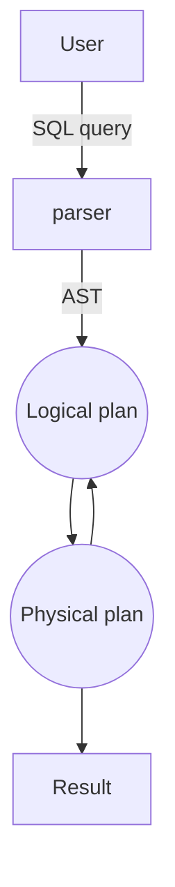

<!-- markdownlint-disable MD010 MD041 MD001 MD036 MD029 MD034-->

## Storage

### Storage hierarchy

Hierarchy (smaller and faster to bigger and slower): CPU registers < CPU Caches < DRAM < SSD < HDD < Network storage

Out-of-orderness is hard in processors because of the data dependencies.

Hierarchy is a thing because of the locality - processors want to reuse the program's locality in the CPU registers, caches.

#### Non-Volatile Memory vs Solid-State Drive

NVM:

Goals - data persists after power-cycle and to reduce random/sequential access gap and no seek/ rotational delays

like DRAM, low latency loads and stores

like SSD, persistent writes and high density

byte-addressible

SSD:

it uses non-volatile flash chips and SSD controller (embedded processor, which bridges flash chips to SSD IO interfaces)

block-addressible

### File storage

Files are made of pages (the communication DRAM to/from SSD), and in pages there are fields that are individual informations.

The goal is to get the page such that it would favor locality (would have more useful material in it).

#### Different file organizations

Heap files: best when typical access is a full file scan. Hard to find a file. Simplest implementation is doubly-linked list.

Sorted files: Best for retrieval in an order, or for retrieving a range. You have to choose a way to sort by.

Log-structured files: it works with an idea of immutability - fast to insert/delete/update, but for reading file needs to be reconstructed from logs.

### Page layout (for relational data)

#### N-ary Storage Model (NSM)

Taking every row and writing it out in the page. You assume that the data will be needed in a row manner.

It has a page header, record headers (useful for variable size records).

When the records are fixed-length, then it is easy to find n-th record.

When the records are variable-length - it used to be separated by special chars, but now it uses record headers with pointers.

And now variable-length records use slot array, which also points to free space, such that the page can be reorganized to use more space efficiently.

#### Decomposition Storage Model (DSM)

Taking columns and put them in the pages.

Initial idea was to decompose all columns and store value of the column + row ID (for reconstruction)

Pros: saves IO by bringing only relevant attributes (but there are a lot of infrastucture for that) and very memory compressing columns is typically easier.

Cons: Writes are more expensive, and need tuple reconstruction.

It is good for compression. Could be Run-length encoding (count the value and store the count + value), Bit-vector encoding (translate value into a bit in the bitstring), Partitioning - Dictionary (value -> number), Frequency partitioning (value -> number only in the page, where dictionaries are smaller).

### Partition Attributes Across (PAX)

Decompose a slotted-page internally in mini pages per attribute.

It is cache-friendly, compatible with slotted-pages, retains NSM IO pattern, and brings only relevant attributes to the cache.

## Query execution and optimization

### Query execution

The **processing model** of a DBMS defines how the system executes a query plan

#### Extreme 1: iterator model

Each query operator implements its **next** function.

On each invocation, the operator returns a single tuple, or empty. Next recursively calls other operators' next functions. This way it passes the tuple through the pipeline and adds it to the query return.

The DBMS traverses the tree. For each node that it visits, it has to figure out what the operator needs to do. Same for expressions. This is done for **every single tuple**

Result:

- Many function calls - save/restore contents of CPU registers, and force a new instruction stream into the pipeline (which is bad for instruction cache)
- Generic code - has to cover every table, datatype and query

It's like getting one beer at the time and storing it.

#### Extreme 2: block-oriented model

Each operator processes its input all at once and emits its output all at once The operator “materializes” its output as a single result. Often bottom-up plan processing.

Naive solution for output materialization problem: process a filters separately for columns and then join them.

Another version: add the filter as extra to the produced filter result instead of joining them.

It can also use selection vector, which is a bitmap which then is joined on

**Tuple materialization problem** - when joining tables, the columns can get shuffled, and it cannot use virtual ids and stiching becomes random access.

Solutions for this:

- Stich columns before join
- Sort lists of table ids before projection
- Use order-preserving joins (jive-joins), but this is not always applicable

Pros of block oriented:

- no next() calls - no per-tuple overhead
- typically combined with columnar storage
- avoid interpretation when evaluating expressions (most of the time)

Con: ouput materialization is costly in terms of memory bandwidth

It's like getting beers in full amount, e.g. 100 beers - heavy to carry

#### Middle ground: vectorized iterator model

It's like getting beers in crates - best of both worlds.

Operator emits vector of tuples instead of a single tuple. The size of vector must fit in the CPU cache.

It is ideal for OLAP queries - Greatly reduces the number of invocations per operator. Allows for operators to use vectorized (SIMD) instructions to process batches of tuples

### Query optimization

For a given query, find the execution plan with the lowest “cost”.

It is the hardest DBMS component to design/implement correctly. No optimizer truly produces the “optimal” plan, since it is expensive to consider all plans (NP-complete), and impossible to get accurate cost of a plan without executing it!

Optimizers make a huge difference in terms of: Performance, Scalability, Resource utilization, Database capabilities

#### Multi-dimensional decision space

In what order to execute operations? (Particularly: relative order of joins)

Which implementation is best for each operation? (E.g., hash joins, nested loop joins, sort-merge joins…)

Which access methods to use? (E.g., scan, use of an index)

Suboptimal decisions can have a huge impact! e.g. use of one join algorithm vs the other, or pushing down selections (that make indexes useless)

#### IO of query optimizer

Input - abstract syntax tree created from the query

Output - full physical plan translatable to code.

#### Classic architecture

Cost estimation is used in logical-physical plan loop



#### Relational algebra equivalences

Key concept in optimization: **Equivalences**. Two relational algebra **expressions** are said to be equivalent if on every legal database instance, the two expressions generate the same set of tuples.

Selections (WHERE clause in SQL) are cascading (s1 and s2 and ... of R === s1(s2(...(R)))) and commutative (s1(s2(R))===s2(s1(R)))

Projections (SELECT clause in SQL) are cascading on the attributes: $\pi_{a_1}(R) \equiv \pi_{a_1}(...(\pi_{a_n}(R)))$, where $a_1$ is a subset of up to $a_n$ projection.

These equivalences allow the push down of selections and projections before the joins

Joins are commutative and associative. This allows us to choose different join order.

#### IO cost example - naive example

S: 16000 tuples = 320 pages. T: 256000 tuples = 5120 pages. C: 1600 tuples = 32 pages. Each student takes 16 courses. Each course has 160 students.

Super-Worst scenario / tuple-by-tuple it takes > 500 years: Cartesian product of fetching a page for each tuple (1 seek per tuple): #tuples(C) \* #tuples(S) \* #tuples(T) = 1’600 \* 16’000 \* 256’000 = 6’553’600’000’000 I/Os. At 2.5ms per I/O -> query takes 519.5 years

Not-Worst-But-Very-Bad scenario (page-by-page) it takes 36 hours: Cartesian product reading pages at a time, not tuples (1 seek per page) #pages(C) \* #pages(S) \* #pages(T) = 32 \* 320 \* 5120 = 52428800 I/Os 52428800 \* 2.5ms = 131072 s -> query takes 36 hours

#### IO cost example - educated approach

S: 16000 tuples = 320 pages. T: 256000 tuples = 5120 pages. C: 1600 tuples = 32 pages.

Use Block-nested loop joins instead of cross product and push down projection - 18s

Push down selection and reorder joins - 1s

#### Simple queries, straightforward plan

Query planning for OLTP queries is easy because they are **sargable** (search argument able)

This means just picking the best index, joins are almost always on foreign key relationships with a small cardinality and can be implemented with simple heuristics

#### Heuristic-based optimization

Static rules that transform logical operators into physical plan

- Perform most restrictive selections early
- Perform all selections before joins
- Predicate/Limit/Projection pushdowns
- Join ordering based on cardinality

Example INGRES and Oracle

INGRES has simple relational tables where it's FK to FK relation. Therefore it is possible for optimizer to split the query into two, e.g.:

Goal: Retrieve the names of artists that appear on Joy's mixtape

```SQL
SELECT ARTIST.NAME
    FROM ARTIST, APPEARS, ALBUM
    WHERE ARTIST.ID=APPEARS.ARTIST_ID
        AND APPEARS.ALBUM_ID=ALBUM.ID
        AND ALBUM.NAME="Joy's Slag Remix"
```

Step 1: Decompose into single-variable queries

```SQL
-- Q1
SELECT ALBUM.ID AS ALBUM_ID INTO TEMP1
    FROM ALBUM
    WHERE ALBUM.NAME="Joy's Slag Remix"

-- Q3
SELECT APPEARS.ARTIST_ID INTO TEMP2
    FROM APPEARS, TEMP1
    WHERE APPEARS.ALBUM_ID=TEMP1.ALBUM_ID

-- Q4
SELECT ARTIST.NAME
    FROM ARTIST, TEMP2
    WHERE ARTIST.ARTIST_ID=TEMP2.ARTIST_ID
```

Step 2: Substitute the values from Q1→Q3→Q4

Advantages:

- Easy to implement and debug.
- Works reasonably well and is fast for simple queries & small tables.

Disadvantages:

- Doesn’t _truly_ handle joins.
- Join ordering based only on cardinalities.
- Naïve, nearly impossible to generate good plans when operators have complex interdependencies.
- Could get stuck at local minima/maxima

#### Heuristics + cost-based optimization

Use static rules to perform initial optimization. Then use dynamic programming to determine best join order for tables.

##### Cost estimation

Generate an estimate of the cost of executing a plan for the
current state of the database.

- Resource utilization (CPU, I/O, network)
- Size of intermediate results
- Choices of algorithms, access methods
- Interactions with other work in DBMS
- Data properties (skew, order, placement)

**Selection without index unsorted**. Cost will change if. Records are sorted based on the condition attribute. We can utilize an index to filter out some records. We need to materialize the output result.

**Page-oriented loop join**: For each tuple in the outer relation R, we scan the entire inner relation S (but use page-loading).
I/O Cost: #pages of R + #pages of R \* #pages of S.

How to choose the outer relation to minimize the cost? - Choose order of R, S, so that #pages of R < #pages of S and Order benefits cost if tables are of different size

##### Selectivity estimates

Estimating intermediary results of query

```SQL
SELECT * FROM R WHERE r.age=18
```

First necessary to estimate cost of operations (e.g. join)

Crude estimation: selectivity = 1/#keys(R.age), estimated #results = #Records(R)/#keys(R.age). Range queries: length of the range/length of the domain. Free if there is an index. It is good estimate when values are uniformly distributed.

Histograms: equi-width and equi-depth. It is higher cost to build and maintain but higher accuracy.

##### Join cardinality estimates

Important to reorder joins so that records are filtered as fast as possible.

Selectivity = 1/max(#keys(R.sid), #keys(S.sid))

Cardinality estimate = #records(R) \* #records(S) / max(#keys(R.sid), #keys(S.sid))

#### System R Optimizer

High level idea:

- Iterate over the possible plans
- Estimate the cost of each plan
- Return the cheapest to the user
