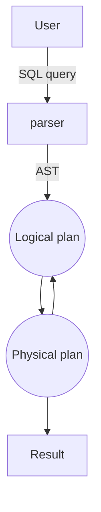

<!-- markdownlint-disable MD010 MD041 MD001 MD036 MD029 MD034-->

## Storage

### Storage hierarchy

Hierarchy (smaller and faster to bigger and slower): CPU registers < CPU Caches < DRAM < SSD < HDD < Network storage

Out-of-orderness is hard in processors because of the data dependencies.

Hierarchy is a thing because of the locality - processors want to reuse the program's locality in the CPU registers, caches.

#### Non-Volatile Memory vs Solid-State Drive

NVM:

Goals - data persists after power-cycle and to reduce random/sequential access gap and no seek/ rotational delays

like DRAM, low latency loads and stores

like SSD, persistent writes and high density

byte-addressible

SSD:

it uses non-volatile flash chips and SSD controller (embedded processor, which bridges flash chips to SSD IO interfaces)

block-addressible

### File storage

Files are made of pages (the communication DRAM to/from SSD), and in pages there are fields that are individual informations.

The goal is to get the page such that it would favor locality (would have more useful material in it).

#### Different file organizations

Heap files: best when typical access is a full file scan. Hard to find a file. Simplest implementation is doubly-linked list.

Sorted files: Best for retrieval in an order, or for retrieving a range. You have to choose a way to sort by.

Log-structured files: it works with an idea of immutability - fast to insert/delete/update, but for reading file needs to be reconstructed from logs.

### Page layout (for relational data)

#### N-ary Storage Model (NSM)

Taking every row and writing it out in the page. You assume that the data will be needed in a row manner.

It has a page header, record headers (useful for variable size records).

When the records are fixed-length, then it is easy to find n-th record.

When the records are variable-length - it used to be separated by special chars, but now it uses record headers with pointers.

And now variable-length records use slot array, which also points to free space, such that the page can be reorganized to use more space efficiently.

#### Decomposition Storage Model (DSM)

Taking columns and put them in the pages.

Initial idea was to decompose all columns and store value of the column + row ID (for reconstruction)

Pros: saves IO by bringing only relevant attributes (but there are a lot of infrastucture for that) and very memory compressing columns is typically easier.

Cons: Writes are more expensive, and need tuple reconstruction.

It is good for compression. Could be Run-length encoding (count the value and store the count + value), Bit-vector encoding (translate value into a bit in the bitstring), Partitioning - Dictionary (value -> number), Frequency partitioning (value -> number only in the page, where dictionaries are smaller).

### Partition Attributes Across (PAX)

Decompose a slotted-page internally in mini pages per attribute.

It is cache-friendly, compatible with slotted-pages, retains NSM IO pattern, and brings only relevant attributes to the cache.

## Query execution and optimization

### Query execution

The **processing model** of a DBMS defines how the system executes a query plan

#### Extreme 1: iterator model

Each query operator implements its **next** function.

On each invocation, the operator returns a single tuple, or empty. Next recursively calls other operators' next functions. This way it passes the tuple through the pipeline and adds it to the query return.

The DBMS traverses the tree. For each node that it visits, it has to figure out what the operator needs to do. Same for expressions. This is done for **every single tuple**

Result:

- Many function calls - save/restore contents of CPU registers, and force a new instruction stream into the pipeline (which is bad for instruction cache)
- Generic code - has to cover every table, datatype and query

It's like getting one beer at the time and storing it.

#### Extreme 2: block-oriented model

Each operator processes its input all at once and emits its output all at once The operator “materializes” its output as a single result. Often bottom-up plan processing.

Naive solution for output materialization problem: process a filters separately for columns and then join them.

Another version: add the filter as extra to the produced filter result instead of joining them.

It can also use selection vector, which is a bitmap which then is joined on

**Tuple materialization problem** - when joining tables, the columns can get shuffled, and it cannot use virtual ids and stiching becomes random access.

Solutions for this:

- Stich columns before join
- Sort lists of table ids before projection
- Use order-preserving joins (jive-joins), but this is not always applicable

Pros of block oriented:

- no next() calls - no per-tuple overhead
- typically combined with columnar storage
- avoid interpretation when evaluating expressions (most of the time)

Con: ouput materialization is costly in terms of memory bandwidth

It's like getting beers in full amount, e.g. 100 beers - heavy to carry

#### Middle ground: vectorized iterator model

It's like getting beers in crates - best of both worlds.

Operator emits vector of tuples instead of a single tuple. The size of vector must fit in the CPU cache.

It is ideal for OLAP queries - Greatly reduces the number of invocations per operator. Allows for operators to use vectorized (SIMD) instructions to process batches of tuples

### Query optimization

For a given query, find the execution plan with the lowest “cost”.

It is the hardest DBMS component to design/implement correctly. No optimizer truly produces the “optimal” plan, since it is expensive to consider all plans (NP-complete), and impossible to get accurate cost of a plan without executing it!

Optimizers make a huge difference in terms of: Performance, Scalability, Resource utilization, Database capabilities

#### Multi-dimensional decision space

In what order to execute operations? (Particularly: relative order of joins)

Which implementation is best for each operation? (E.g., hash joins, nested loop joins, sort-merge joins…)

Which access methods to use? (E.g., scan, use of an index)

Suboptimal decisions can have a huge impact! e.g. use of one join algorithm vs the other, or pushing down selections (that make indexes useless)

#### IO of query optimizer

Input - abstract syntax tree created from the query

Output - full physical plan translatable to code.

#### Classic architecture

Cost estimation is used in logical-physical plan loop



#### Relational algebra equivalences

Key concept in optimization: **Equivalences**. Two relational algebra **expressions** are said to be equivalent if on every legal database instance, the two expressions generate the same set of tuples.

Selections (WHERE clause in SQL) are cascading (s1 and s2 and ... of R === s1(s2(...(R)))) and commutative (s1(s2(R))===s2(s1(R)))

Projections (SELECT clause in SQL) are cascading on the attributes: $\pi_{a_1}(R) \equiv \pi_{a_1}(...(\pi_{a_n}(R)))$, where $a_1$ is a subset of up to $a_n$ projection.

These equivalences allow the push down of selections and projections before the joins

Joins are commutative and associative. This allows us to choose different join order.

#### IO cost example - naive example

S: 16000 tuples = 320 pages. T: 256000 tuples = 5120 pages. C: 1600 tuples = 32 pages. Each student takes 16 courses. Each course has 160 students.

Super-Worst scenario / tuple-by-tuple it takes > 500 years: Cartesian product of fetching a page for each tuple (1 seek per tuple): #tuples(C) \* #tuples(S) \* #tuples(T) = 1’600 \* 16’000 \* 256’000 = 6’553’600’000’000 I/Os. At 2.5ms per I/O -> query takes 519.5 years

Not-Worst-But-Very-Bad scenario (page-by-page) it takes 36 hours: Cartesian product reading pages at a time, not tuples (1 seek per page) #pages(C) \* #pages(S) \* #pages(T) = 32 \* 320 \* 5120 = 52428800 I/Os 52428800 \* 2.5ms = 131072 s -> query takes 36 hours

#### IO cost example - educated approach

S: 16000 tuples = 320 pages. T: 256000 tuples = 5120 pages. C: 1600 tuples = 32 pages.

Use Block-nested loop joins instead of cross product and push down projection - 18s

Push down selection and reorder joins - 1s

#### Simple queries, straightforward plan

Query planning for OLTP queries is easy because they are **sargable** (search argument able)

This means just picking the best index, joins are almost always on foreign key relationships with a small cardinality and can be implemented with simple heuristics

#### Heuristic-based optimization

Static rules that transform logical operators into physical plan

- Perform most restrictive selections early
- Perform all selections before joins
- Predicate/Limit/Projection pushdowns
- Join ordering based on cardinality

Example INGRES and Oracle

INGRES has simple relational tables where it's FK to FK relation. Therefore it is possible for optimizer to split the query into two, e.g.:

Goal: Retrieve the names of artists that appear on Joy's mixtape

```SQL
SELECT ARTIST.NAME
    FROM ARTIST, APPEARS, ALBUM
    WHERE ARTIST.ID=APPEARS.ARTIST_ID
        AND APPEARS.ALBUM_ID=ALBUM.ID
        AND ALBUM.NAME="Joy's Slag Remix"
```

Step 1: Decompose into single-variable queries

```SQL
-- Q1
SELECT ALBUM.ID AS ALBUM_ID INTO TEMP1
    FROM ALBUM
    WHERE ALBUM.NAME="Joy's Slag Remix"

-- Q3
SELECT APPEARS.ARTIST_ID INTO TEMP2
    FROM APPEARS, TEMP1
    WHERE APPEARS.ALBUM_ID=TEMP1.ALBUM_ID

-- Q4
SELECT ARTIST.NAME
    FROM ARTIST, TEMP2
    WHERE ARTIST.ARTIST_ID=TEMP2.ARTIST_ID
```

Step 2: Substitute the values from Q1→Q3→Q4

Advantages:

- Easy to implement and debug.
- Works reasonably well and is fast for simple queries & small tables.

Disadvantages:

- Doesn’t _truly_ handle joins.
- Join ordering based only on cardinalities.
- Naïve, nearly impossible to generate good plans when operators have complex interdependencies.
- Could get stuck at local minima/maxima

#### Heuristics + cost-based optimization

Use static rules to perform initial optimization. Then use dynamic programming to determine best join order for tables.

##### Cost estimation

Generate an estimate of the cost of executing a plan for the
current state of the database.

- Resource utilization (CPU, I/O, network)
- Size of intermediate results
- Choices of algorithms, access methods
- Interactions with other work in DBMS
- Data properties (skew, order, placement)

**Selection without index unsorted**. Cost will change if. Records are sorted based on the condition attribute. We can utilize an index to filter out some records. We need to materialize the output result.

**Page-oriented loop join**: For each tuple in the outer relation R, we scan the entire inner relation S (but use page-loading).
I/O Cost: #pages of R + #pages of R \* #pages of S.

How to choose the outer relation to minimize the cost? - Choose order of R, S, so that #pages of R < #pages of S and Order benefits cost if tables are of different size

##### Selectivity estimates

Estimating intermediary results of query

```SQL
SELECT * FROM R WHERE r.age=18
```

First necessary to estimate cost of operations (e.g. join)

Crude estimation: selectivity = 1/#keys(R.age), estimated #results = #Records(R)/#keys(R.age). Range queries: length of the range/length of the domain. Free if there is an index. It is good estimate when values are uniformly distributed.

Histograms: equi-width and equi-depth. It is higher cost to build and maintain but higher accuracy.

##### Join cardinality estimates

Important to reorder joins so that records are filtered as fast as possible.

Selectivity = 1/max(#keys(R.sid), #keys(S.sid))

Cardinality estimate = #records(R) \* #records(S) / max(#keys(R.sid), #keys(S.sid))

#### System R Optimizer

High level idea:

- Iterate over the possible plans
- Estimate the cost of each plan
- Return the cheapest to the user

Essentially is programs that write other programs.

##### Abstract Steps

**Step 1**: break the query up into blocks and generate the logical opereators for each block - this reduces complexity of each plan.

Block definition: no nested queries, exactly one SELECT and FROM and at most one WHERE, GROUPBY, HAVING

**Step 2**: for each individual block: for each logical operator, consider a set of physical operators and offered access paths. Then iteraticely construct a "left-deep" tree that minimizes the estimated amount of work to execute the plan.
Join order is important because it gets rid of the most amount of data.
Left-join mostly offers the best performance benefit because the rightmost file can be parsed and immediately shown. It also offers dynamical programming due to the fact that BNL can incrementally join together.

Access path - data scan.

##### System R Optimizer Steps

**Step 1**: Choose the best access path to each table

**Step 2**: Enumerate all possible join orderings for the tables

**Step 3**: Determine the join ordering with the lowest cost.

At every step only keep the lowest cost or most interesting order.

If this was Naive - try all possible orders, it would be N! (for N joins)

**Principle of optimality** - the optimal plan for k joins is produces by extending the optimal plan(s) for k-1 joins. This, with dynamic programming, ends up being $O(N \times 2^^{N-1})$

This is a very aggressive optimizer, meaning it leaves out some paths that could be more efficient down the road, but it's designed to be faster.

#### Revisited principle of optimality

Principle of optimality may lead to suboptimal plans - e.g. order is not considered -> additional cost at the end (avoided by sort merge join)

**Relaxed principle of optimality** - aimed at what the output is expected to be, e.g. for the ordered output - a plan is compared with all other plans that produce the same order

#### Revisited selectivity estimates

if there is no index and no histogram or complex predicates, we cannot estimate #Keys(R.age).

When everything else fails, revert to magic #Keys(R.age)=10.

## Execution models for distributed computing

### Big data

The three (plus two) Vs: Big data is high _volume_, high _velocity_, and/or high _variety_ information assets that require new forms of processing to enable enhanced decision making.

- _Volume_: The quantity of generated and stored data.
- _Velocity_: The speed at which the data is generated and processed.
- _Variety_: The type and nature of the data.
- _Variability_: Inconsistency of the data set.
- _Veracity_: The quality of captured data.

### Query models

- Shared-nothing model - Each machine does not share any resources with any other machine. To communicate to another machine only through network.
- Shared-everything model - Each machine shares everything with other, therefore all cpus can talk with each other, and access any memory
- Shared-memory model - There is a unified memory space for all, coherency is very easy, but there are problems.

#### Shared-nothing model (message-passing model)

No shared data, therefore we need declustering (spreading data between disks).

Ways to do it:

- Attribute-less partitioning (random, round-robin)
- Single Attribute Schemes (Hash declustering, Range declustering) - like sorting
- Multiple Attributes schemes possible (MAGIC, BERD etc)

##### Hash declustering

Essentially creates a skewed distribution.

Selections with equality predicates referencing the partitioning attribute are directed to a single node. Therefore less queries are made

Equality predicates referencing a non-partitioning attribute and range predicates are directed to all nodes.

##### Range declustering

Partition depending on the range.

The more you know about your data or, better, the more you know about your queries, the better is the distribution.

Equality and range predicates referencing the partitioning attribute are directed to a subset of nodes.

Predicates referencing a non-partitioning attribute are directed to all nodes.

##### Declustering tradeoffs

Range selection predicate using a clustered B+-tree 0.01% selectivity (result is 10 records). (B+-tree is the tree, where the attributes are never interfering).
The range declustering method is way better than hash/random/round-robin methods.

If the selectivity goes up to 1% selectivity (result is 1000 records), then ranges drops very quickly, below hash/random/round-robin methods.

This is because at low selectivity range was distributing the data all over, so the specific records were found, but then hash/random/round-robin kept the same spread.

#### Distributed Join

partition inputs to buckets, eahc bucket fits in join processors' aggregate memory

Partition and join each bucket pair across join processors

#### Distributed Aggregation

Compute aggregate locally for each node

redistribute by hashing group attribute and aggregate partial results

### MapReduce

MapReduce approach - code using functional model, hide complexity behind a library.

It is simple distributed computation on a complex data.

e.g. convert all text to upper case:

Simple mapping:

1. split data file into splits (can be stored in different nodes)
2. apply map operation to each split
3. collect all outputs together to get the result

MapReduce:

1. split data file into splits (can be stored in different nodes)
2. apply map operation to each split
3. use reducers to collect the data in smaller maps
4. collect all outputs together to get the result

MapReduce is simple and scales very well. Problem is the amount of reads and writes (which is because map and reduces are agnostic to each other), and the problem is reducer waiting for mapper to finish.

### Spark

Goals:

- Improve expressiveness and extensibility of model
- Make coding easier: strive for high-level code
- Enable additional optimizations
- Improve performance by better utilizing the hardware

It implements very interesting abstractions that help maintain MapReduce and improves some issues of it.

#### Resilient Distributed Datasets (RDD)

Collection of elements that is distributed across the network and it's single.

It is immutable.

Distributed, fault-tolerant collections of elements that can be operated in parallel

There is a lineage maintained, because when it is changed the history can be kept due to its immutability.

Lazily evaluated.

RDDs contain: details about the data, leneage (history) information to enable recreating a lost split of an RDD (dependencies from other RDDs and functions/transformations)

Essentially it is dataflow programming.

#### Limitations of vanilla Spark

RDDs are schema-less, which makes it inefficient (same as accessing raw text files), and expensive (high space overhead)

Spark has an extension which translates RDDs to data frames.

## Concurrency control

### ACID & Transaction Schedules

**Transaction (txn, or Xact)** - sequence of actions executed on a shared database to perform some higher-level function. Basic unit of change in the DBMS.

**ACID**:

- **Atomicity** - Either all actions in the txn happen or none happen
- **Consistency** - if each txn is consstent and the DB starts consistent, it ends up consistent
- **Isolation** - Execution of one txn is isolated from that of other txns
- **Durability** - if a txn commits, its effects persist

Txn could either commit after completing all its actions or abort after executing some of its actions

All transactions are atomic.

Durability relies on logs.

Each transaction must leave the database in a consistent state

Users submit transactions, and expect isolation -- each txn executed by itself. **Concurrency** is very important for the performance. Net effect identical to executing all txns one after the other in some serial order.

For concurrency, DBMS uses schedules - a list of actions (reading, writing, aborting or committing) from a set of txns.

#### Scheduling transactions

- **Serial schedule** - schedule that does not interleave the actions of different transactions.
- **Equivalent schedules** - for any db state, the effect (on the set of objects in the db) of executing the first schedule is identical to the effect of executing the second schedule
- **Serializable schedule** - a schedule that is equivalent to some serial execution of the txns.

Anomalies with interleaved execution:

- Dirty reads - WR conflicts - reading uncommitted data
- RW conflicts - unrepeatable reads
- WW conflicts - overwriting uncommitted data

#### Aborting a transaction

If txn is aborted, all its actions need to be undone. And due to **cascading aborts** the dependent txns need to be aborted (e.g. if Tj reads an object last written by Ti, Tj must be aborted as well)

#### Precedence graph

One node per txn, edge from Ti to Tj if Tj reads/writes an object last read/written by Ti.

**Theorem** - a schedule is conflict serializable iff its dependency graph is acyclic.

**Conflict serializable** - if schedule is conflict equivalent to some serial schedule. I.e. they involve the same actions of the same txns, every pair of conflicting actions is ordered the same way -> basically if we can turn the one into the other by swapping non-conflicting adjacent actions

### Pessimistic concurrency control protocols

#### Lock-based concurrency control

There are 2 ways to prevent incosistencies. Preventing - lock everything, or detection + correction - let it happen and then fix everything if anyting goes wrong.

Locking protocol guarantees that schedule will be conflict serializatble (correct) if it completes. And the question is when to hold the lock.

Locking granularity can be anything: tables, indexes, pages, records.

##### Two-pahse locking (2PL) Protocol

Rule 1: Shared and exclusive locking (corresponds to read/write locks)

Rule 2: a transaction (txn) cannot request additional locks once it releases any locks.

2PL allows only schedules who precedence graph is acyclic, therefore it's serializable

Strict 2PL only allows locking (meaning no unlocking), and unlocks only when transaction is committed.

Deadlock - T1 is waiting for a lock which is held by T2, T2 is waiting for T3, and T3 is waiting for T1. To get out of this everything needs to be killed. Deadlock detection is very expensive, but there is deadlock prevention algorithm

### Optimistic concurrency control protocols

No locking because conflicts are rare.

#### Kung-Robinson Model

**Idea**: Every txn is ordered by the exact time it arrived to the system. While txn exectes, it collects its write set and read set. After which there is a validation phase. Validation phase checks that all conflicting actions occurred in the same order. Either it gets validated and writes are commited to the storage, or invalidated and not written.

This relies on the timestamps of the txns.

There are 4 cases for a txn that arrives for it to check previous txns, For all i and j such that Ti < Tj, check that Ti completes before Tj begins.:

- that Ti already finished
- that Ti writes before Tj writes
  - does Tj read dirty data? -> to check, the Tj read set does not intersect with write set of Ti
- that Ti reads before Tj reads
  - does Ti overwrite Tj's writes? -> to check, the Tj write set does not intersect with write set of Ti (Tj's one should persist)

#### Comments on validation

Validation is a critical section, and nothing else goes on concurrently. BUT if the validation/write phase is long, then it is major drawback.

Optimization for read-only txns: shorter critical section because there is no Write phase.

### Timestamp-based CC

**Continuous validation** - not a distinct phase

Read and write timestamps per object, which means the validation happens after each action. If the validation fails, we abort the transaction

There are 4 actions to choose after the comparison of txn timestamp with read/write timestamps of the objects: continue, abort, commit, skip write

> When the validation fails, the new txn is created with a new timestamp. Then validation is running again with newly completed txns.

**Idea:** txn timestamp TS begin time

**Object**: read-timestamp (RTS) and a write-timestamp (WTS)

When txt T wants to **READ** object O:

- TS(T) < WTS(O): violates timestamp order of T w.r.t. writer of O.
  - Abort T and restart it with a new, higher TS.
- TS(T) >= WTS(O):
  - Allow T to read O.
  - Reset RTS(O) to max(RTS(O), TS(T))
- Change to RTS(O) on reads must be written in some persistent fashion 🡪 overhead.

When txt T wants to **WRITE** object O:

- TS(T) < RTS(O): violates timestamp order of T w.r.t. reader of O
  🡪 abort and restart T.
- TS(T) < WTS(O) 🡪 violates timestamp order of T w.r.t. writer of O. 🡪 ???
  - Thomas Write Rule: Outdated write 🡪 Safely ignore the write – it’s as if the write happened before and was overwritten
  - need not restart T!
  - Allows some serializable schedules (correct) that are not conflict serializable.
- Else, allow T to write O (and update WTS(O)).

### Multiversion CC

Recognising the fact that most transactions read all the time.

Goal: txn never waits on read

**Idea**: Maintain several versions of each database object (multi-version), each with a read and a write timestamp. Transaction Ti reads the most recent version whose write timestamp precedes TS(Ti).

#### Writer txn

To read an object, follow reader protocol

To write an object:

- finds newest version V
- RTS(V) > TS(T) - reject write
- RTS(V) <= TS(T) - T makes a copy CV of V, with a pointer to V, with WTS(CV) = TS(T), RTS(CV) = TS(T) (write is buffered/locked until T commits, other txns cannot read version CV, such that every txn's effect need to persist for the txns that follow)

### Bottlenecks

lock thrashing - 2PL, strict 2PL

timestamp allocation - all T/O algorithms + deadlock prevention

memory allocation - MVCC, OCC

#### Improving performance

**Snapshot isolation** - take the whole database snapshot, and if no conflicting writes were made, take the whole snapshot.

Snapshot isolation (SI) is the most popular isolation guarantee in real DBMS.

- all txn reads will see a consistent snapshot of the database
- the txn successfully commits only if no updates it has made conflict with any concurrent updates made since that snapshot.

SI does not guarantee serializability!

## Query execution and distributed transactions

### Parallel architectures

#### Shared memory

Nodes share both RAM and disk. Dozens to hundreds of processors, easy to use and program, BUT expensive to scale.

#### Shared disk

All nodes access same disks (which are found in the largest non-cluster multiprocessors)

Traditionally hard to scale past a certain point - due to contention on storage bandwidth. Existing deployments have < 10 machines

However due to cloud incarnation - running over Amazon s3 or other service, there is an arbitrary scaleout because **S3 has a lot of disks and executors are stateless**.

#### Shared nothing

Cluster machines on high-speed network.
Where each machine has its own memory and disk. (each machine might run several nodes in it).

Characteristics: most scalable today (because of lowest contention) but hard to manage and tune (e.g. because of data rebalancing when adding a new node)

### Distributed transactions

#### Single node vs distributed txns

Single-node txn accesses the data on one partition, whereas distr txn accesses data at one or more partitions, so it requires expensive coordination between concurrent transactions.

#### Transaction coordination

Two types:

- **Centralized** - global "traffic coordinator"
- **Decentralized** - nodes organize themselves.

#### Distributed concurrency control

Need to allow multiple transactions to execute simultaneously across multiple nodes.

Many of the protocols from single-node DBMS can be adapted

It is harder because of:

- network communication overhead
- clock skew
- node failures
- replication
- distributed 2PL:
  - increased clock duration
  - who detects deadlocks?
- timestamp-based:
  - whose clock is correct?
  - can we have 1 global clock?

##### Distributed locking

- Centralized: One site does all locking.
  - Vulnerable to single site failure.
- Primary Copy: All locking for an object done at the primary copy site for this object.
  - Reading requires access to locking site as well as site where the object is stored.
- Fully Distributed: Locking for a copy done at site where the copy is stored.
  - Locks at all sites while writing an object

##### Distributed recovery

If sub-transactions of an txn execute at different sites, all or none must commit

A log is maintained at each site, as in a centralized DBMS, and commit protocol actions are additionally logged.

#### Commits

When a multi-node transaction finishes, the DBMS needs to ask all of the nodes involved whether it is safe to commit.

Nodes must use an **atomic commit protocol** - all nodes have to agree. E.g.:

- Two-phase commit
- Three-phase commit (many assumptions; not used)
- Paxos
- Raft
- ZAB (Apache Zookeeper)

#### 2PC (Two-phase commit)

Site at which Xact originates is coordinator; other sites at which it executes are subordinates.

First phase - collect information.

Second phase - implement a decision.

When txn wants to commit:

- coordinator sends **prepare** msg to each subordinate (do you all agree that this txn should be committed?)
- subordinate force-writes an **abort** or **prepare** log records and then sends a _no_ or _yes_ msg to coordinator.
- if coordinator gets unanimous yes votes, force-writes a **commit** log records and sends a **commit** msg to all subs. Else, force-writes abort log rec, and sends **abort** msg
- Subordinates force-write **abort/commit** log rec based on msg they get, then send **ack** msg to coordinator.
- Coordinator writes **end** log rec after getting all acks.

> Recovery system:
>
> 1. log records (ARIES style) - long record, and any time there is a new transaction it adds its actions to the log. One reason is if the txn was aborted, it needs to be **undone**. Another reason - failure to make the value to the disk - action needs to be **redone**.
> 2. Redo then undo - txn table where there are winners and losers, so winners need to redo actions, and losers undo actions

Commets on 2PC:

- a lot of messages because of the two rounds of communication
- any site can decite to abort a txn, all sites must agree to commit.
- Every msg reflects a decision by the sender; **to ensure that this decision survives failures, it is first recorded in the local log**
- Because of logging 2PC is expensive because of the force-writes - we need to wait for the log to be on disk before moving on.

ACKs are sent to ensure everyone knows final outcome.

Subordinates force-write the log records so that they do not need to ask the coordinator about the info.

#### 2PC with presume commit (optimization on 2PC)

Because of the idea that most txns usually commit, I assume that everything is fine.

Cheaper to Require ACKs for Aborts and to Eliminate ACKs for commits.

Force only **abort\*** (star means forced), no information means commit! Problem - Commit after crash of the coordinator after sending out “prepare”!

Record subordinate names before prepared state
⇒Subordinates as in PA; coordinator writes collecting\* (star means forced)
⇒Read-only optimizations apply here

#### 2PC with presume abort (optimization on 2PC)

This is the opposite to presumed commit, but it's not used.

#### 2PC Coordinator failures & Blocking

If coordinator for Xact T fails, subordinates who have voted yes cannot decide whether to commit or abort T until coordinator recovers. **T is blocked** and even if all subordinates know each other (extra overhead in prepare msg) they are blocked unless one of them voted no.

### Replication

Copying data is annoying but necessary for availability, and failures.

Replication:

- keep several copies of the data in other servers
- if a server fails, another server takes over
- use for load balancing

**Synchronouse replication**: All copies of a modified relation (fragment) must be updated before the modifying Xact commits.

**Asynchronous Replication**: Copies of a modified relation are only periodically updated; different copies may get out of sync in the meantime.

#### Synchronous replication

Two versions:

- Voting: Xact **must write a majority** of copies to modify an object; **must read enough copies** to be sure of seeing at least one most recent copy
- Read-any Write-all: Writes are slower and reads are faster, relative to Voting. (Most common approach to synchronous replication)

Cost - very expensive:

- Before an update Xact can commit, it must obtain locks on all modified copies:
  - Sends lock requests to remote sites, and while waiting for the response, holds on toother locks!
  - If sites or links fail, Xact cannot commit until they are back up.
  - Even if there is no failure, committing must follow an expensive commit protocol
    with many msgs.

Due to the cost, alternative of asynchronous replication is widely used in NoSQL systems (eventual consistency)

#### Asynchronous replication

Allows modifying Xact to commit before all copies have been changed (and readers nonetheless look at just one copy).

Two approaches: **Primary Site** and **Peer-to-Peer** replication. - Difference lies in how many copies are _"updatable"_ or
_"master copies"_

##### Primary site

Exactly one copy of a relation is designated the primary or master copy. Replicas at other sites cannot be directly updated.

- The primary copy is published.
- Other sites subscribe to (fragments of) this relation; these are secondary copies.

Main issue: How are changes to the primary copy propagated to the secondary copies?

– Done in two steps. First, capture changes made by committed Xacts; then
apply these changes.

**Implementing the Capture step**:

- **(Physical) Log-Based Capture**: The log (kept for recovery) is used to generate a Change Data Table (CDT). This is faster one.
  - If this is done when the log tail is written to disk, must somehow remove changes due to subsequently aborted Xacts.
- **Procedural Capture**: A procedure that is automatically invoked (ex: trigger) does the capture; typically, just takes a snapshot. This is slower but more portable.
- Log-Based Capture is cheaper & faster, but relies on proprietary log details.
- Middle-ground: Logical log-based capture
  - [MySQL] Row-based replication: Describe edits at row granularity

**Implementing the Apply step**:

The Apply process at the secondary site periodically obtains (a snapshot or) changes to the CDT table from the primary site, and updates the copy. Replica can be a view over the modified relation!

Log-Based Capture plus continuous Apply minimizes delay in propagating changes.

Procedural Capture plus application-driven Apply is the most flexible way to process changes.

#### Peer-to-Peer (multi-leader) Replication

More than one of the copies of an object can be a master in this approach.

Changes to a master copy must be propagated to other copies somehow.

If two master copies are changed in a conflicting manner, this must be resolved. (e.g., Site 1: Joe’s age changed to 35; Site 2: to 36)

### Eventual consistency

Tracking mutable, replicated state. Due to replication we need to decide: Synchronous or asynchronous? And Can processes read from / write to any replica? What are we going to do in case of the failure?

#### CAP Theorem

**Consistency** - linearizability

**Availability** - all alive nodes can satisfy all requests

**Partition Tolerance** - operate correctly despite message loss

We cannot have all 3 at once.

## Gossip-based computing

### Achieving random topologies

#### Peer sampling service

Provide sample of the network to each node.

How: by building a random graph with an out-degree of f. In a decentralized way.

Goal: create an overlay network. Provide each peer with a random sample of the network.

Means: gossip-based protocol - what data should be gossiped? To whom? How to process the exchanged data?

Result is "who knows who" graphs - overlay of Properties (degree, clustering, diameter, etc.), Resilience to network dynamics, Closeness to random graphs

Objective is to provide nodes with a peer drawn uniformly at random from the complete set of nodes. Sampling is accurate: reflects the current set of nodes. Independent views. Scalable service

Using gossip, we will periodically exchange the knowledge of the system.

##### System model of the service

- System of n peers
- Peers join and leave (and fail) the system dynamically and are identified uniquely (IP @)
- Epidemic interaction model:
  - Peers exchange some membership information periodically to update their own membership information
  - Reflect the dynamics of the system
  - Ensures connectivity
- Each peer maintains a local view (membership table) of c entries
  - Network @ (IP@)
  - Age (freshness of the descriptor)
  - Each entry is unique
  - Ordered list
- Active and passive threads on each node

##### Operations on partial views (membership)

- selectPeer() - returns an item
- permute() - randomly shuffles items
- increaseAge() - forall items add 1 to age
- append(...) - append a number of items
- removeDuplicates() - remove duplicates (on same address), keep youngest
- removeOldItems(n) - remove n descriptors with highest age
- removeHead(n) - remove n first descriptors
- removeRandom(n) - remove n random descriptors

##### Threads of the peer

> assume no byzantine behaviour

Active thread:

```pseudocode
Wait (T time units) // T is the cycle length

p <- selectPeer() // Sample a live peer from the current view

if push then // Takes initiative
  myDescriptor <- (my@,0)
  buffer <- merge (view, {myDescriptor}) //temporary list
  view.permute() //shuffle the items in the view
  move oldest h items to end of the view //to get rid of old nodes
  buffer.append(view.head(c/2)) // copy first half of the items
  send buffer to p
else send{} to p //triggers response

if pull then
  receive buffer from p
  view.selectView(c,h,s,buffer)

view.increaseage(viewp)
```

Passive thread

```pseudocode
Do forever

Receive bufferp from p

if pull then
  myDescriptor <-(my@,0)
  buffer <-merge(view,{myDescriptor}) // here we append ourselves with age 0
  view.permute ()
  move oldest h items to end of the view
  buffer.append(view.head(c/2))
  send buffer to p

view.selectView(c,h,s,buffer)
view.increaseage(view_p)
```

##### Design space

Periodically each peer initiates communication with another peer

**Peer selection**:

selectPeer(): returns a live peer from the current view

- Rand: pick a peer uniformly at random
- Head: pick the “youngest” peer
- Tail: pick the “oldest” peer

Note that _head_ leads to correlated views - self-reinforcement leads to bias of the view.

**Data exchange** (View propagation) - How peers exchange their membership information?

- push: Node sends descriptors to selected peer
- pull: Node only pulls in descriptors from selected peer
- pushpull: Node and selected peer exchange descriptors

Pulling alone is pretty bad: a node has no opportunity to insert information on itself. Potential loss
of all incoming connections.

Buffer (h)

- initialized with the descriptor of the gossiper
- contains c/2 elements
- ignore h “oldest”

Communication model

- Push: buffer sent
- Push/Pull: buffers sent both ways
- (Pull: left out, the gossiper cannot inject information about itself, harms connectivity)

**Data processing** (View selection): Select (c, buffer) where c: size of the resulting view, and Buffer: information exchanged

Select(c,h,s,buffer):

1. Buffer appended to view
2. Keep the freshest entry for each node
3. h oldest items removed
4. s first items removed (the one sent over)
5. Random nodes removed

Merge strategies

- Blind (h=0,s=0): select a random subset
- Healer (h=c/2): select the “freshest” entries
- Shuffler (h=0, s=c/2): minimize loss

Where:

- c: size of the resulting view
- h: self-healing parameter
- s: shuffle
- Buffer: information exchanged

##### Existing systems

Lpbcast [Eugster & al, DSN 2001,ACM TOCS 2003]

- Node selection: random
- Data exchange: push
- Data processing: random

Newscast [Jelasity & van Steen, 2002]

- Node selection: head
- Data exchange : pushpull
- Data processing : head

Cyclon [Voulgaris & al JNSM 2005]

- Node selection: random
- Data exchange : pushpull
- Data processing : shuffle

Comparison metrics:

- Degree distribution
- Average path length
- Clustering coefficient

### A generic gossip-based substrate

Each node maintains a set of neighbors (c entries)

Periodic peerwise exchange of information

Each process runs an active and passive threads

And the parameter space for this is peer selection, data exchange and data processing

This is useful for many things, nowadays for decentralized learning, it used to be for graph parting.

#### Gossip-based aggregation

Each node holds a numeric value s

Aggregation function: average over the set of nodes

Active thread:

```pseudocode
do exactly once in each consecutive delta time units at randomly picked neighbor:

  q = GetNeighbour()
  send s_p to q

  s_q = receive(q)
  s_p = Update(s_p, s_q)
```

Passive thread:

```pseudocode
do forever:
  s_q = receive(*)
  send s_p to sender(s_q)
  s_p = Update(s_p, s_q)
```

- Assume getneighbor() returns a uniform random sample
- Update(sp,sq) returns (sp + sq)/2
- Operation does not change the global average but redistributes the variance over the set of all estimates in the system
- Proven that the variance tends to zero
- Exponential convergence

##### Counting with gossip

1. Initialize all nodes with value 0 but the initiator
2. Global average = 1/N
3. Size of the network can be easily deduced
4. Robust implementation
   1. Multiple nodes start with their identifier
   2. Each concurrent instance led by a node
   3. Message and data of an instance tagged with a unique Id

##### Ordered slicing

Each node has a value (storage). We want to separate them in separate same-size groups. E.g. split the memory load to 3 groups: first 33%, second 33%, last 33%

- Create and maintain a partitioning of the network
- Each node belongs to one slice
- Ex: 20% of nodes with the largest bandwidth
- Network of size N
- Each node _i_ has an attribute xi
- We assume that values (x1 , xN) can be ordered
- Problem: automatically assign a slice (top 20%) for each node

Each time there is a problem with matching random value with the actual node value (sorted), we exchage the random numbers between those values. Then the resulting (initially random) values will be representing the slices correctly.

## DHTs

### Distributed systems complexity

No global clock, so no single global notion of the correct titme

Unpredictable failures of components

Highly variable bandwidth

possibly large and variable latency - few ms to several seconds

### Architectures

client server, datacenters/cloud, decentralized

### Decentralized architectures

#### P2P applications

~50% of the Internet traffic

Applications - mastadon, torrent, blockchain, streaming protocols, decentralized AI

#### Why is it interesting

- End-nodes are promoted to active components
- Nodes participate, interact, contribute to the services they use.
- Harness huge pools of resources accumulated in millions of end-nodes.
- Avoid a central/master entity
- Irregularities and dynamicity are treated as the norm

#### Overlay networks

Decentralized system implemented over decentralized network. This is higher layer over the internet

Unstructed overlays - random graphs that are hard to deal with because it requires flooding for search.

Structured overlays - nodes, in addition to identification by IP address, also have a role of being in a position in that structure.

#### Hash tables

Data structure that has put() and get() operations, and has efficient indexing such that read is quick.

Distributed hash table does the same thing but across millions of hosts on the internet. P2P infrastructure ensures mapping between keys and physical nodes. No node has entire view of the system but has enough local knowledge to route the key to the node.

#### Distributed hash table

partitions data in large-scale distributed system:

- Tuples in a global database engine
- Data blocks in a global file system
- Files in a P2P file-sharing system

Lookup would be in a structured overlay,

### Implementations of DHTs

#### Pastry

**P2P routing infrastructure**

Overlay: network abstraction on top of IP

Basic functionality: distributed hash table: `key = SHA-1(data)`

An identifier is associated to each node `nodeId = SHA-1(IP address)`

Large identifier space (keys and nodeId)

A node is reposible for a range of keys

Routing: search efficiently for keys

**Object distribution**

128 bit cirular id space (0 to $2^^{128} - 1$) - _nodeIds_ (uniform random) and _objIds_ (uniform random)

node with numerically closest _nodeId_ maintains that object.

There can be unbalance to the system, e.g. when a file is accessed frequently, so the responsible node will have higher traffic

**Naming space** - Ring of 128 bit integers, and _nodeIds_ chosen at random

**Key/node mapping** - key associated to the node with the numerically closest node id

**Routing table** - to have efficient routing such that if churn is experienced, it is still possible to access the data.

**Leaf set** - 8 or 16 closest numerical neighbors in the naming space

##### Pastry routing table

We split the circle such that in each part there is a path from node to a representative from a different part.

Routing tables based on prefix matching:

- Identifiers are a set of digits in base 16
- Matrix of 128/4 lines et 16 columns
- routeTable(i,j):
  - nodeId matching the current node identifier up to level I
  - with the next digit is j

**Example:**

Consider a peer with id 01110100101
Maintains a neighor peer in each of the following prefixes:
1, 00, 010, 0110, …

At each routing step, forward to a neigbor with the largest matching prefix

##### Pastry routing

Leaf set helps with partitioning, i.e. if there are too many nodes that are disconnected.

Each node will contain 8 or 16 all the closest neighbors, which also enables direct access to the node when the prefix matches.

Routing algo is week 8 slide

##### Node departure

Explicit departure or failure

Graceful replacement of a node

The leafset of the closest node in the leafset contains the closest new node, not yet in the leafset.

Update from the leafset information - since we're already routing in the correct partition, and the main replica node fails, the neighboring node will have the replica and it will be found through leafset.

Update the application.

##### State maintenance

**Leaf set** (maintained with pings), is aggressively monitored and fixed; and is eventual guarantee up to L/2 nodes with adjacent nodeIds fail simultaineously.

**Routing table** is lazily repaired - when a hole is detected during the routing. It is periodic gossip-based maintenance

##### Reducing latency

**Random assignment of nodeId** - nodes numerically close are geographically (topologically) distant

Objective - fill the routing table with nodes so that routing hops are as short (latency wise) as possible

Topological metric is _latency_

## Consistency models

Replication is key to availability (low latency, failure resilience, load balancing). But it creates inconsistencies due to concurrent accesses.

### When is it needed?

Whenever objects are replicated

Replicase must be consistent in some way: modifications have to be carried out on all copies, and in the presence of concurrent updates/reads

Differenc consistency models - a consistency model is a set of rueles that process obeys while accessing data. Edge cases - strong consistency (having the latest updates), and eventual consistency (maintain the replica, such that eventually everyone will have the same data)

### Examples of consistency guarantees

Strong consistency - seee all previous writes

Eventual consistency - see subset of previous writes

Consistent prefix - see initial sequence of writes

Monotonic freshness - see increasing sequence of writes

Read my writes - see all writes performed by reader

Bounded staleness - see all "old" writes

### Strong consistency

Aka linearizability , one-copy serializability

The responses to the operations invoked in an execution are the same as if all operations were executed in a sequential order and this order respects those specified by each process

Strong consistency is impossible to achieve in the presence of partition (CAP-next lecture)

Strong consistency is impossible to achieve in an asynchronous system without assumptions on message delivery latencies (FLP) - thinking the node is slow but it actually failed or vice-versa. To fix this we have a timeout.

**Guarantee**: see all previous writes. All reads at time t should reflect all the writes that happened before t.

## Key-value store

### CAP theory skipped (first 18 slides of week9)

### Key-value Abstraction

For example:

1. (twitter.com) tweet id -> information about tweet
2. (amazon.com) item number -> information about it
3. (expedia.com) flight number -> information about flight, e.g., availability
4. (bank.com) account number -> information about it

- A dictionary datastructure, but distributed.
  - Insert, lookup, and delete by key
  - E.g., hash table

Key-value stores reuse many techniques from DHTs.

#### Key-value/NoSQL Data Model

NoSQL = Not Only SQL

Necessary API operations: get(key) and put(key, value)

Tables:

- “Column families” in Cassandra, “Table” in HBase, “Collection” in MongoDB
- Like RDBMS tables, but …
- May be unstructured: May not have schemas - Some columns may be missing from some rows
- Do not always support joins or have foreign keys

#### Cassandra

Objectives:

- Distributed storage system
- Targets large amount of structured data
- Intended to run in a datacenter (and also across DCs) across many commodity servers
- No single point of failure
- But: does not support joins, limited support for transactions and aggregation

(Originally designed at Facebook, Open-sourced later, today an Apache project (2010))

It actually is:

- A distributed key-value store
- Many companies use Cassandra in their production clusters
  - IBM, Adobe, HP, eBay, Ericsson, Symantec
  - Twitter, Spotify
  - PBS Kids
  - Netflix: uses Cassandra to keep track of your current position in the video you’re watching
- Scalable data model: data split across nodes
- C**AP**: availability and partition tolerance

##### Cassandra data model

Table in Cassandra: distributed multi-dimensional map indexed by a key

**Row**: identified by a Unique Key (Primary key)

**Keyspace**: A logical container for column families that defines the replication strategy and other configuration options

**Column Family**: A logical grouping of columns with a shared key, contains Supercolumns or Columns

**Column**: basic data structures with key, value, timestamp

**Supercolumn**: stores a map of sub-columns. Columns that are likely to be queried together should be place in the **same column family**

You want the key to contain different information sets to be accessed by it.

**Facebook example**:

FB maintains a per-user index of all messages exchanged between senders and receivers

Two kind of search features enabled in 2008: Term search, Interactions: given a person’s name, returns all the messages sent/received by that person

Term search:

Primary key: UserID,
Words of messages: super columns,
Columns within the super columns: individual message identifiers (messageId) of the messages that contains the word

Inbox search (interactions):

primary key - UserID,
Recipients IDs: super columns,
Columns within the super columns: messageId

With this data structure we have granularity for both terms and interactions, so we can access both in the specific super column families.

##### Cassandra architecture

1. Partitioning
2. Replication
3. Membership
4. Scaling

Decentralized storage system for managing large amount of data

All nodes participate in a cluster : Peer-to-peer paradigm

Scale-out architecture: Add or remove server as needed

Typically a read/write request for a key gets routed to any node that hold a replica

Writes: routed to the replicas and wait for a quorum

Reads: depends on the consistency guarantees (any replica or quorums (majority))

###### Partitioning (similar to DHT)

- Incremental scale
- Consistent hashing for partitioning (order-preserving hash function)
- Dynamic partition of the data over a set of nodes in a cluster organized in a ring
- Each node is assigned a random value which determines its place on the ring
- Each data item is assigned to a node by hashing its key
  - The key defines the item position on the ring
  - Each node is responsible for the region of the ring between itself and its predecessor on the ring (Chord model)
- Departure or arrival affect only immediate neighbours
- Full membership (Routing done in O(1), since you know everyone)

Data Partitioning:

Random Partitioning leads to non-uniform data and load distribution, The basic algorithm is oblivious to the heterogeneity in nodes’ performance

It is addressed by: 1) Load information is analysed on the ring: Lightly loaded nodes move on the
ring to alleviate loaded ones, 2) Virtual nodes (e.g. if the ring is very busy, we can create new nodes to distribute the load or have nodes that are virtually on the oposite sides of the ring)

###### Partitioning in Cassandra

- Replication factor: determines how many copies of the data exist
- Each data is replicated at N hosts (N=replication factor)
- Coordinator node is in charge of the replication of the data items
- Consistency level refers to the consistency achieved among replicas
- Various replication strategies

Partitioner: determines how data is distributed across the nodes in the cluster (including replicas)

**Replication strategies**:

1. **Simple Strategy**: uses the Partitioner, of which there are two kinds
   1. RandomPartitioner: Chord-like hash partitioning
   2. ByteOrderedPartitioner: Assigns ranges of keys to servers. (Easier for range queries (e.g., Get me all twitter users starting with [a-b]))
2. **NetworkTopologyStrategy**: for multi-DC deployments

###### Writes

**Coordinator**: acts as a proxy for the application and the nodes involved in the request flow. Responsible for managing the entire request path and to respond back to the client

Writes need to be lock-free and fast (no reads or disk seeks)

Client sends write to one coordinator node in a Cassandra cluster: Coordinator may be per-key, or per-client, or per-query, Per-key Coordinator ensures writes for the key are serialized

Coordinator uses Partitioner to send queries to one or all replica nodes responsible for the key

When X replicas respond, coordinator returns an acknowledgement to the client

Always writable: Hinted Handoff mechanism
If any replica is down, the coordinator writes to all other replicas, and keeps the write locally until the down replica comes back up.
OR When all replicas are down, the coordinator (front end) buffers writes (for up to a few hours).

**One ring per datacenter**. Per-DC coordinator (only 1) elected to coordinate with other DCs. Election done via Zookeeper, which runs a Paxos (consensus) variant

**Data structures**:

Commit log - Transactional log, used for recovery in case of failures

Memtables (in memory) - Write-back cache of data partitions that can be searched by key. In-memory representation of multiple key-value pairs. Append-only data structure (fast)

SSTables Sorted String Tables (disk): Persistent, ordered immutable map from keys to values, where both keys and values are arbitrary byte strings. And a Bloom filter (for efficient search). This is where the memtables flush

**Memtable flushes**:

- Background thread keeps checking the size of all memtables
- When a new Memtable is created, the previous one marked for flushing
- Node’s global memory threshold have been reached
- Commit log is full
- Another thread flushes all the marked Memtables
- Commit log segments of the flushed Memtable are marked for recycling
- A Bloom filter (data structure that is efficient to tell you if the item is there or not (especially when it's not there). It's a hash of the key and put to bitmap. There is some probability of false positives but it's possible to fix this either by extending bits or changing the hash function) and index are created

###### Reads

Similar to writes, except:

1. Coordinator can contact X replicas (e.g., in same rack) - Coordinator sends read to replicas that have responded quickest in the past. Takes the last timestamp from the responded ones.
2. Coordinator also fetches value from other replicas - Checks consistency in the background, initiating a read repair if any two values are different. This mechanism seeks to eventually bring all replicas up to date
3. At a replica - Read looks at Memtables first, and then SSTables. A row may be split across multiple SSTables => reads need to touch multiple SSTables => reads slower than writes (but still fast)

###### Membership protocol

- Any server in cluster could be the coordinator
- So every server needs to maintain a list of all the other servers that are currently in the cluster: full membership
- Membership needs to be updated automatically as servers join, leave, and fail

Efficient anti-entropy gossip-based protocol

P2P protocol to discover and share location and state information about other nodes in a Cassandra cluster

##### Consistency in Cassandra

Cassandra has consistency levels. Client is allowed to choose a consistency level for each operation (read/write):

- ANY: any server (may not be a replica)
  - Fastest: coordinator caches write and replies quickly to client
- ALL: all replicas
  - Ensures strong consistency, but slowest
- ONE: at least one replica
  - Faster than ALL, but cannot tolerate a failure
- QUORUM: quorum across all replicas in all datacenters (DCs)
  - Global consistency, but still fast
- LOCAL_QUORUM: quorum in coordinator’s DC
  - Faster: only waits for quorum in first DC client contacts

**Quorum-based protocols**

Each client should acquire the permission of multiple servers (quorum) before reading or writing a replicated data

Suppose: N replicas exist, R: read quorum, W: write quorum

Constraints : 1. R+W>N 2. W>N/2

The first constraint is used to prevent read-write conflicts, whereas the **second prevents write-write conflicts**. Only after the appropriate number of servers has agreed to participate can a file be read or written.

Quorum = majority (> 50%)

1. Any two quorums intersect
2. Client 1 does a write in red quorum
3. Then client 2 does read in blue quorum
4. At least one server in blue quorum returns latest write

(Associated with timestamp)
