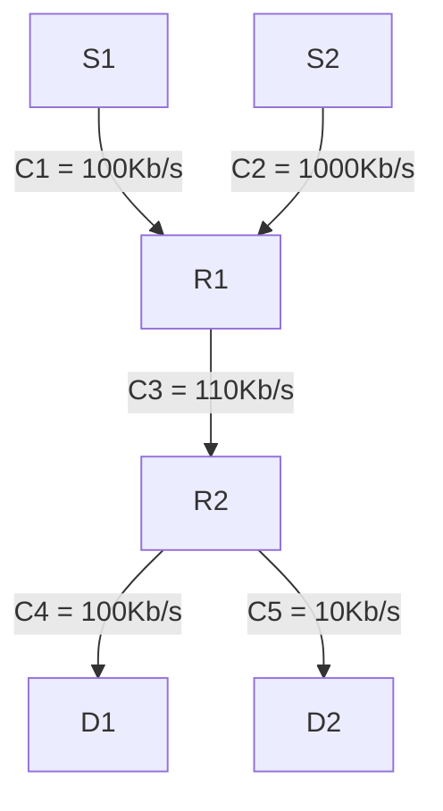
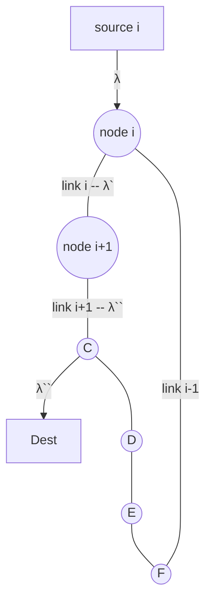
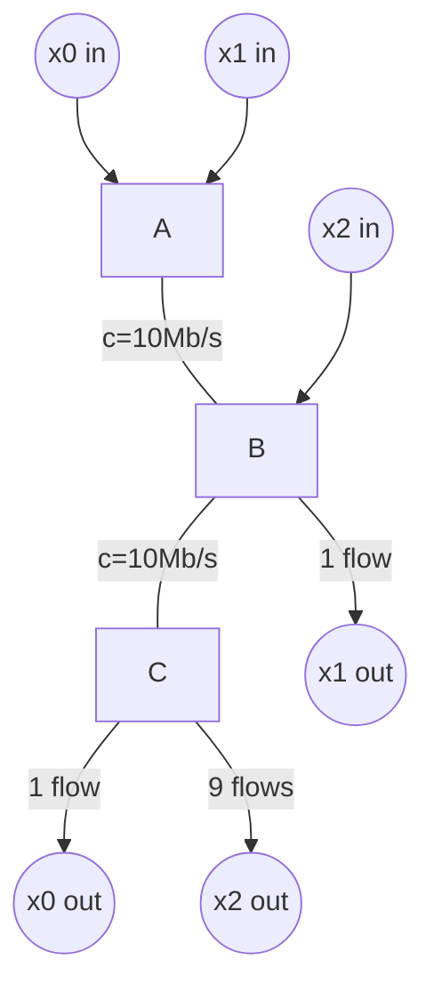

<!-- markdownlint-disable MD010 MD041 MD001 MD036 MD029-->

## Layers

Layers are abstractions of services with specific interfaces on the devices.

Layers (top to bottom):

1. Application (HTTP, FTP, email)
2. Transport (TCP, UDP)
3. Network (IP)
4. Data link (Ethernet)
5. Physical (fiber optics, wires)

We need layers to organize the systems. It offers flexibility and modularity.

Each layer is built on top of another and offers functionality to the layer on top of it.

### Application layer

Creates a commnunication connection.
Transfers files, etc. (encryption)

### Transport layer

Creates a virtual link.
Uses ports.

### Network layer

Packet switching over many links

It is more efficient than message switchin because it reduces buffer required in routers, and reduces end-to-end delay.
This is because the each device in the sequence needs to get the whole message from the link.

Basic functions:

- Forwarding - when a packet arrives at a router's input link, the router moves the packet to the appropriate output link. It is based on the packet header.
- Routing - network layer determines the route/path. They run routing protocols.

Forwarding - most common protocol IP
IP forwarding is based on the IP addresses.
It offers best-effort approach so there is no guaranteed delivery. Packets could be delayed, dropped, or reordered - the flow can take different routes/paths.

In the LAN all device IP addresses have same prefix (common part).

In IPv4 it is 32bit addresses.
In IPv6 it is 128bit addresses and uses hex notation.
They are incompatible, since IPv6 has different headers.

IP subnets - LAN
All machines have to have same prefix.
IP subnet prefix is specified using a subnet mask - if it is 16bit subnet mask, then the last 16 digits are free to choose.

### Data link layer (MAC layer)

Is responsible for moving data from one node to an adjacent node over a **single** communication link (wired or wireless)..

Services provided depend on the physical link.

Possible functions/services included:

- error detection and correction
- reliable delivery
- collistion avoidance
- flow control
- link access and multiplexing for the transmission medium

This layer uses MAC addresses (48bits) which are set by the manufacturer.

The packets are frames that are delivered to anyone that has access to the link and only the one that it is addressed to takes the frame.

Routers vs switches

Router = a system (or program) that forwards packets based on IP addresses
Switches = a system (or program) that forwards packets based on the MAC addresses
LANs are interconnected by routers and there every machine in LAN has to know IP address of the 1-hop router (default gateway)

### Physical layer

It transforms bits and bytes to the waves. Does all the encoding and decoding.

Bit rate is bits per second.
Bandwith is width of the frequency range that can be used ofr transmission over the channel.

There are limits to some channels (e.g. Shannon's law)

### Skipped first part of the lecture

## Network layer - middle

### IP Rule #1 = Structured addresses + Longest prefix match

goal of IP is to connect all systems using IP addresses

Every network interface has a structured IP address that is prefix + suffix.

Router has a forwarding table that links prefixes to output

### IP Rule #2 = Don't use routers inside LAN/subnet

Implication:

- between LANs/subnets use routers, inside each subnet do not
- hosts in same subnet must have same subnet mask and same subnet prefix

### IPv4

32 bits usually writen in dotted decimal notation.
Unequely identifies one interface in the internet (in principle)

#### Special addresses

| address                                   | meaning                                                                                      |
| ----------------------------------------- | -------------------------------------------------------------------------------------------- |
| 0.0.0.0                                   | absence of address                                                                           |
| 127.0.0/24 for example 127.0.0.1          | this host (loopback address)                                                                 |
| 10.0.0.0/8, 172.16.0.0/12, 192.168.0.0/16 | private networks (e.g. at home) used by anyone, but cannot be used on the public Internet    |
| 100.64/10                                 | private addresses used only by Internet Service Providers (ISPs)—Carrier Grade NAT addresses |
| 192.88.99/24                              | IPv6-to-IPv4 relay routers                                                                   |
| 169.254.0.0/16                            | link local address (can be used only between systems on same LAN)                            |
| 224/4                                     | multicast                                                                                    |
| 240/4                                     | reserved until recently                                                                      |
| 255.255.255.255/32                        | link local (LAN) broadcast                                                                   |

### IPv6

Why new version - IPv4 address space was too small
What does IPv6 do: same thing as IPv4, but with more address space but is not backwards compatible

Forwarding tables work essentially the same with prefixes.
Except it uses local IP address with interface number separated byt %

For every IPv6 interface there has to be a global IP address and local IP address.

Compression rules for IPv6 addresses:

- uses hex digits in hextets (4 hex digits)
- hextets separated by :
- leading zeroes in a hextet are omitted
- :: replaces any number of 0s in more than one hextet; appears at most once in address

Only one block 2000/3 is allocated for global unicast addresses.

### NAT

Internet service provider gives one IP address, but if you have n devices at home you need more than one IP address.

NAT is motivated to not run out of the IP addresses by creating local network addresses. This applies to VMs and a single host.

**Goal of NAT:** allow n > 1 devices to use one single IP address. It is a middle box that deviates from the TCP/IP arch - it violates:

- the IP principle that addresses should identify hosts uniquely
- layering

#### What does it do?

It translates internal IP addresses and port numbers to NAT IP address and NAT port numbers.
From outside, one sees only NAT IP address (public) and NAT port

NAT forwarding is based on **exact matching** in NAT table. Implemented by iptables in Linux; ports are UDP or TCP.

NAT because of this reduces the amount of processes possible to run on a machine, but we have 65000 available port numbers. And adds additional delay because the packets are processed - transport and network layer headers edited.

There could be nested NATs.

Internal addresses in IPv4 are typically private addresses.

#### How does NAT maintain NAT table?

It creates entry on-the-fly when cliend on internal network contacts server on external network.
NAT chooses a NAT port that does not create collision in the table.

#### Servers behind NAT

Assume A has a server on tcp port 5000.

Problem: Automatic operation automatic operation of NAT requires for the server to start the communication which does not happen.

Solution: manual configuaration of port forwarding in NAT.
A still needs to find out its NAT address to advertise to other devices. A discovers its NAT IP address with STUN server or UPnP (it is unsafe and we shouldn't use it).

This provides protection to home network: a server port number can only be accessed if explicitly configured, while servers on the internet are exposed in general to attacks and need to be actively protected.

NAT table port entries are allocated randomly (pseudo randomly), and the entries are not there forever.

#### NATs and IPv6, v1

NAT was developed for IPv4, motivated by the lack of IPv4

With IPv6, home routers often do not use NAT because provider typically allocates a block of IPv6 addresses, not just one as with IPv4

With IPv6 the home router provides protection by acting as a filtering router - allows communication from outside only if initiated from inside.

#### NATs and IPv6, v2

There is a system to still use IPv6

Assume local network receives only one IPv6 address, not entire prefix.
Solution: use NAT with link local IPv6 addresses on internal network.
Local network should be restricted to one LAN (only one subnet)

this is used by the VirtualBox("NAT network")

#### Carrier-grade NATs

"Carrier-grade" NAT shares p external NAT addresses with n > p internal hosts. So there are multiple external interfaces.

Example is VPN access of EPFL. Some users might be connected with the same address, or some might be different.

These are NATs behind NATs: A is 192.168.178.34 at home, as 10.252.13.211 in EPFL VPN and as 128.178.15.x in the public internet

Some internet service providers do the same in order to reduce the number of IPv4 addresses allocated to end-users. They use the block 100.64/10 instead of 10/8

#### More on NATs

Mapping (internal addr, internal port) -> (NAT addr, NAT port) is independent of the external corrsepondent. If this mapping is constant, then **full cone NAT** can be used to support servers behind NAT. (servers use STUN servers to get their publicly seen IP address)

Not all NATs are full cone.

There is a **symmetric** NAT that has the mapping (internal addr and port, external (someone outside) addr and port) -> (NAT addr, NAT port). So the mapping learnt by one external correstpondent S cannot be used or guessed by another S'

ICMP packets don't have a port number. Some NATs don't support ICMP, but many do. Those are smart NATs that manipulate _ICMP echo request identifier_ instead of the port number.

### MAC address resolution

WHY?
And IP machine A has a packet to send to a next-hop B (could be a final destination or next-hop router). A knows B's IP address, and A must find B's MAC address.

HOW?
Broadcast or multicast a packet to LAN asking "who has the IP of B?"
All hosts that have IP address of B respond with their MAC address.

#### MAC address resolution with IPv6 (NDP)

1. A sends a Neighbour Solicitation (NS) packet using the Neighbour Discovery Protocol (NDP) with question "who has IP address B"
   1. The dest IP address of the NS packet is a special multicast address (solicited Node Multicast Address) = last 24 bits are copied by IP's address
2. B responds with Neighbour Advertisement (NA) packet, giving its MAC address. This NA packet is sent by B to A
3. A reads NA, stores MAC address in neighbour cache (also called ARP table). This entry expires after a timer declared by OS.

NA, NS packets are carried as ICMPv6 packets - next-header = 58 (0x3a), inside IPv6 packets.

The convention in IPv6 is not to use broadcast.

The solicited node multicast address:
last 24bits are left for the identifier (reuses the last 24 bits of the IP address), and we reser 104 bits for the multicast. This is because these nodes are in the same LAN

The more specific the question is the better for the network.

#### MAC address resolution with IPv4 (ARP)

ARP request/ARP reply instead of NS/NA packets

Theses are MAC frames where Ethernet = ARP (86dd)

ARP request is broadcast to all nodes in LAN

ARP is another protocol that is in-between MAC and Network layers. In its header there is a Protocol field that shows which protocol initiated the request, and in this case it would be IP.

#### Security issues with ARP/NDP

ARP requests/replies may be falsified (ARP spoofing)
Atacker will capture all packets intended to B. This is the way to do MITM attack in LAN.

Prevention: This is done only in big enterprise networks.
using smart switches - they remember association the IP to MAC addresses. This is called **DHCP snooping**, where DHCP is used to automatically configure the IP address at system startup.

**Dynamic ARP inspeciton** - switch filters all ARP (or NDP) traffic and allows only valid answers - removes broadcasts (IPv4) and multicasts (IPv6)

#### Secure NDP

Make NDP spoofing impossible

How?
Assymetric crypto:

- Host B has a pub/priv key par P/p
- B uses CGA( cryptographically generated address) = secure hash of P and IPv6 address prefix (and other fields such as counters) - this binds the IP adddress to P
- NA message sent in response to A contains a signature computed with p
- A can verify signature using P
- only the owner of p (secret) can send a valid NA

Some necessary things: they need to have strong has function and Resource Public Key Infrastructure (RPKI) (similar to CA).

### Host/Interface Conifguration

IP can be configured manually or automatically:

- IP address of interface
- Mask of this interface
- IP address of default router
- IP address of DNS server

Some protocols: DHCP for IPv4 and IPv6, SLAAC for stateless IPv6

#### DHCP

Server in LAN, where all the information info is kept.

Problem: host cannot contact the DHCP server since it does not know of **any** IP address initially.
Solution: broadcast in IPv4 or multicast in IPv6 in LAN to discover DHCP server
Details:

- either there is DHCP in LAN
- there isn't a DHCP in LAN and router relays the message to external server
- DHCP uses two phase commit with acks to avoid inconsistent reservations
- DHCP server suses limited lifetime allocations - DHCP lease.

#### SLAAC (Stateless Address Autoconfiguration)

It is a protocol designed to avoid configuring DHCP serverse and/pr obtain a configuration automatically even if there is no DHCP server.

How it works:

1. how auto-configures a link local address with a 64-bit prefix (fe80::/64) + a 64-bit host address part obtained by one of the following: (manually configured, derived from MAC address, randomly assigned and teporary, randomly assigned but same in same subnet, cryptographically generated address (CGA) - hash of pub key or host + subnet)
2. host performs address duplication test by sending a mylticast packet to the solicited node multicast addess with the same 24 last bits as its own address
3. host tries to also obtain globally valid address by obtaining network prefix from routers if any presend.

It does not provide DNS information.

### there is other stuff in slides that i skipped - 58-74 in ip

## MAC

### Medium access control

exists so that sharing a cable is possible and using a shared wireless radio link

If there is a shared medium, there are collisions.

Solutions:
Mutual exclusion protocol + distributed
Joint decoding -- used in cellular networks

### Mutual exclusion

Deterministic - static partitioning on time or frequency to avoid collisions (TDMA, FDMA) and works for only few users

other deterministic - every host takes a turn and passes a token to next host

Random access protocols that allow collisions but detect if they occur (retrasnmissions at _random_ time)

#### ALOHA

Collisions occur when two packet transmissions overlap and if a packet is lost - then the source has to retransmit (no retransmission strategy is defined here)

There is no feedback to the source in case of collision

Max utilization is only 18% which is small. This is assuming ideal retransmission policy

#### CSMA (carrier sense multiple access)

assumes single transitive channel (everyone can hear everyone).

improves efficiency from ALOHA by listening to the channel before transmitting

It avoids many collisions but not all because of propagation delays - if two stations sense the free medium, and then have to backoff, it can again start transmittting.

CSMA works well only if the transmission time is much larger than propagation, namely bandwidth-delay product << frame size

In order to avoid repeated collisions there is a random backoff.

#### CSMA/CD (Collision detection)

When the collision is found (transmitting and started receiving), jam signal is transmitted. Then a random backoff

Acks are not necessary because absence of collision means that the fram could be retransmitted

Random backoff increases exponentially if repeated collisions occur

Minimum frame size is necessary to guarantee collision detection -> CSMA/CD uses min frame siOld-style Ethernet was shared medium (either used
coax cables or hubs with twisted-pair coppze 64B

#### CSMA/CA - WiFi

Acks are used to detect collisions (by abscence)

Carrier sensing is used but collision detection does not always work (exposed terminal problem)

### Switched ethernet

It is based on switches = beidges

Switches forward frames based on MAC addresses and they have queuing system (frame buffers)

Switches use full-duplex cables which means frames flow simultaneously in both directions without having collisions.

Ethernet is transparent protocol and since there are no collisions, CSMA/CD is desabled by default

#### Forwarding frames

Exact match forarding algorithm:

- listen to all traffic on all ports
- for each frame - read the destination MAC and obtain the destination porrt (if dest port == origin port, no need to forward)
- if dest address is not in the table - broadcast to all ports except origin

Smarter switches handle multicast addresses separately

Populating:

- self-learning from source MAC address
- learnt addresses time out if not re-learnt after "ageing time"

different from IP routers that use routing algorithms

This populating does not always work - if there are loops in the topology

#### Spanning Tree Protocol (STP)

Forces the active topology to be a tree that spans all switches by deactivating some links

Adapts to link failures and additions whenever needed

How?:

1. Switches elect one root switch - switch with smallest label ID
2. Only links that are along the shortest path to root switch become active - spanning tree = set of shortest paths to root switch
3. all switches monitor whether the root is reachable, and if not re-computation of a new spanning tree

It is distributed algorithm
Each link between switches has a (configurable) cost
Shortest paths are identified by using a variant of the Bellman-Ford algorithm

**Side-effect** - all frames go through the spanning tree, direct link between two non-root switches may not be used even if it is optimal

It is less efficient than the shortest path
Some more sophisticated switches implement Shortest path bridging instead of STP

### Ethernet frame format

Has error detectio with Frame Check Sequence. Uses CRC 32bits
If frame fails the check, it is dropped.

#### MAC Unicast

MAC address - 48 bits - unique worldwide (adpter ID)

In shared-medium LAN - all stations read all frames but keep only if destination address matches
In switched Ethernet - switches forward only to ports that need it

#### MAC Broadcast

In shared-medium LAN all machines receive the packet and don't discard it
In switched ethernet - broadcast frames are sent on all nodes and ports on the spanning tree

#### MAC Multicast

MAC addresses with 8th bit == 1 are multicast addresses

makes sense only in switched Ethernet - ethernet adapter discards multicast packets unless host subscribes to address
non-smart switches broadcast such frames
smar switches send only to relevant nodes

### Virtual LANs

Invented to have more traffic isolation
to make more efficient use of switches
to manage users

Goal: decouple who belongs to which LAN from their physical location

They are handled as if they are physically separate

How does it work?:

- configure which switch port belongs to which VLAN
- switch handles ports of different VLANs as separate, non communicating worlds
- switches are interconnected via **trunk** ports that use VLAN tags in an ehternet's extended header in order to correctly allocate frames to VLANs

### Bridges

switches that are used between different medium access technologies (e.g. WiFi and ethernet)

**Wifi access point** is a bridge example.
It consists of wifi base station and a switch with an ehernet backend (called the Distribution System)

### Security aspects

MAC addresses are sent in the clear, so there are possible attacks:

- eavesdropping
- free riding
- impersonation

Solutions (MACSEC):

- Access control - requires user to show credentials before allowing access to the network
  - share secret (E.g. Wifi WPA-Personal) - same password for all users
  - per-user authentication (e.g. wifi WPA-Enterprise) - user has a personal password
- Authentication - every MAC frame is signed using crypto and numbered - prevents free riding and impersonation
- Encryption - MAC frame payload is encrypted (not MAC address) - prevents eavesdropping

## TCP and UDP

Transport layer makes the network services available to programs and is in end-systems only

### UDP

uses port numbers and the server's port numbers must be well-known to clients

src and dest port numbers are inside transport-layer header

**Server** - the role of a program that waits for requests to come (abstraction in this context)

#### UDP is message-oriented

UDP delivers the exact message or nothing

one message, up to 65535 bytes

consecutive messages may arrive out of order
messages may be lost

If a UDP message is larger than the maximum size for the IP layer (MTU) then fragmentation is done -this is not visible to the application layer

#### Socket library

there are IPv4 and IPv6 sockets, so to get what we _can_ have we do `socket.getaddrinfo()`

This does not affect UDPv6 - UDP and TCP are not affected by IP layer

IPv6 socket can be dual-stack - (on some dual-stack machine) IPv6 socket can be bound to both IPv6 and IPv4 addresses of the local host
This is achieved by mapping correspondents' IPv4 to IPv6 addresses using the IPv4-mapped IPv6 address format - last 32 bits are of IPv4

#### Socket from Operating system perspective

Socket is just 2 buffers - one for sending and one for receiving.
Sending buffer is necessary because if there is a backoff, the information needs to be stored somewhere
Receive buffer is necessary because we could be receiving more data than the application can read. But there could be a buffer overflow - UDP does not do anything about this.

At sending side OS sends the UDP datagram ASAP

At receiving side OS reassembles UDP packets (if needed) and keeps them in buffer.

### TCP

Packets could be lost because of buffer overflow, physical layer errors, or reordered because of different paths

UDP does nothing about that
TCP does that at transport layer

TCP guarantees that the data is delivered in order and without loss

TCP does not do data fragmentation, it makes packets of the required MTU size

#### TCP delivery guarantee

Sender sends packet with seq a:b, receiver sends back ack with b. Ack is a cumulative ack which means that it has received everything up to that ack.
There are also selective acks (sack) - that received a packet of x:y, such that retransmission would not include that one.

TCP receiver uses a **receive buffer** = _re-sequencing buffer_ to store incoming packets before delivering them to application
This is because:
Application might not be able to take in the data
pakcets might have arrived out-of-order but kept invisible to application

**Duplicate acks** - acknowledgement with the same ack number as before (could have a `sack` in addition)

#### Sliding window

the receive buffer may overflow if one piece of data "hangs" (myltiple losses affect the same packet, so there are multiple out-of-order packets fill the buffer)
The sliding window limits the number of data "on the fly" - not yet acknowledged

How does it work:
window size - 4000B, each segment - 1000B
Only seq numbers that are in the window may be sent
lower window edge = smallest non acknowledge sequence number
upper window edge = lower edge + window size

Fixed size window cannot prevent receive-buffer overflow, because the receiver application might not be fast enough to read the data.

#### Flow control

Adaptive window size is sent from the receiver to the sender to show how much space is currently in the receive buffer.
Sender adapts source's sending rate to the receiver's buffer.

it's not equal to congestion control.

_What is a problem when a 0 window is sent:_
We need to make sure that the sender is later unblocked. This can be done by sending the same ack but with different window. But this new ack can be lost.
So TCP allows sender to send 1 byte to check whether the windown has changed (like probing)

What is the minnimum window size required for sending at the maximum possible rate: RTT \* link capacity (bits/second)

### TCP Connection and sockets

I know SYN sequence and FIN sequence

#### Sockets

Difference from UDP - they need to open and close the connection

TCP connection is identified by src IP, src port, dest IP, dest port

From OS POV the buffers are re-sequencing buffers.

#### MSS and segmentation

TCP avoids to segments its data at IP layer so makes segments into maximum segment size (MSS).

Default values are:

- 536 bytes for IPv4 operation
- 1220 bytes for IPv6 operation

Otherwise negotionated in Options header field during connection setup

TCP offers streaming service, which is not great for connections that do not immediately fill up the TCP block (HTTP/2, streaming video, etc)

### More TCP details

Corner cases - application writes 1 byte into the socket - should TCP send a packet or wait for more bytes to be written? (This is an overhead because header is 20 bytes). Also, should it only send in when the MSS is full?
**Nagle's algorithm** prevents sending many small packets. This overhead makes TCP suffer only in WAN because LANs are fast. When we receive an ack (get RTT), then send all the data. If the RTT is small (network fast), the overhead does not make big impact.

How to avoid silly window-increase advertisements by 1 byte?

Window field is 16bits, hence the max throughput for RTT=1msec is approx. 524Mbps - can we increase this?
**yes**, use _scaling factor_ fof the window during connection setup

#### TCP loss detection

**timer - retransmission timeouts (RTO)** - when one timer expires, it is interpreted as a severe loss in the channel (nothing can be delivered in the channel anymore). Then all timers are reset, all un-acked data is marked as needing retransmission.

**duplicate ACK** - a TCP packet where the ACK value repeats a previously received ACK value. Means that the daat is out of order.

##### Round trip time (RTT) estimation

RTO must be set at a value larger than RTT, because otherwise we flood the network.
How to estimate RTT - moving average with the last measured RTT, smoother RTT and RTT variability metric.

RTO increases depending on the variability of RTT which is always absolute value. Therefore it can be quite inaccurate at sometimes. So, it could be better to look more at duplicate acks rather than wait for a complete timeout.

#### Fast Retransmit

Instead of waiting for one duplicate ACK, we wait for `n` duplicate ACKs, and then declare loss.

However, it fails when one of the last segments of an application layer block is lost, fast retransmit does not detect it. Also, it may often fail due to packet re-ordering.
It does not detect bursts of loss, if (forward or reverse) channel is broken, and isolated/single packets that are lost are not detected.

2 counter measures for the retransmissions that were not lost but just reordered:

- IP layer **per-flow load balancing**
- **RACK (recent ACK)** instead of duplicate ACKs - it decides that packet p is lost if another out-of-order packet is acked and p has not been ACKed after the estimated RTT + configrable reordering (time) window. Bases retransmissions on timers not seq nums

#### SYN Cookies (= specific initial SEQ numbers)

To mitigate the impact of SYN flood attack - lots of bogus SYN packets from (spoofed) source addresses sent to a server.

When server receives a SYN packet it allocates some space for the socket and enters SYN state. To control this, there was a limit for the sockets in SYN state, which allows the SYN flood attack, since server would not have more space for new requests.

So instead of creating the SYN state, we create SYN cookie, which is a sequence number.
SYN Cookie = (5 bits of a slow timer) mod 32 || (3 bits) MSS encoded in SYN || (24 bits) crypto hash of secret server key, timestamp and client IP address and port number, the server IP address and port number.

This does not completely diminish the threat of DoS attack, by attacker sending ack=y+1
However, now client should have the same amount of memory for states and the server needs to have to ack these syn-acks.

With SYN Cookies it takes more time for server to send back the SYN-ACK due to the computation required for the cryptographic hash.
So any damage that could happen from the attack is the loss of computation for the hashes.

Also, this does not stop the DDoS

#### TCP Fast Open (FTO)

Avoid 3-way handshake when opening repeated connections.

In the first SYN-ACK TCP client receives inside TCP options and caches a cookie that contains **authentication tag t = MAC(k,c)** (message authentication code) computer by server key with secret key k and client IP address c.

In the next connection client can send data in SYN packet. When receiving SYN and tag t, sever already knows that this client is a real one that has connected before. And server can send data already in SYN-ACK.

### Secure Transport

TCP is not secure unless we use another sublayer on top - TLS.

TLS adds to TCP:

- Confidentiality - data is encrypted with symmetric encryption, which are created on the fly for this session (using privkeys)
- Authentication - data is protected against forgery, and identity of end-system us authenticated.

TLS before 1.3 used RSA key exchange with CA signed certificates.

A digital certificate contains a public key of the server and the identity of the server. The public key of the the CA could be included in the certificate but it could have been tampered with so we should not use it.

##### TLS 1.3

Does not support RSA key exchange.

In principle, it needs 1-RTT handshake before sending message.

Communicating parties agree on cryptographic suites, and exchange crypto parameters to exchange session keys.

##### TLS sockets

are transformetd TCP sockets, which wrap the sockets with necessary crypto parameters after SYN sequence - server/client hello.

2 RTTs are necessary for the data transfer (from TCP perspective). 1 RTT from TCP handshake, and 1 RTT from TLS handshake.

## IP Multicast

SLAAC uses the multicast to find the prefix of the network by sending the messages to nearby routers.

Multicast is used to send to a group of destinations. (E.g. for the streaming the same stream on several devices)

In multicast, there is a multiplication of the packets which means that using TCP on top of multicast would not make sense because of the sequence numbers.

Multicast is done through specific address spaces - 223.0.0.0/4 and ff00::/8.

An IP multicast address is used to identify a group:

- Any source multicast (ASM): the group is identified by the multicast address, any source can send to this group
- Source specific multicast (SSM): the group is defined by (s, m) where m is multicast address and s is the source address. Only s can send to this group. By default 232.0.0.0/8 and ff3x::/96 are SSM addresses

### SSM

destinations subscribe via IGMP (internet group management protocol in IPv4) or MLD (Multicast Listener Discovery in IPv6), send join messages to their gateway routers. These routers will keep this information in their cache, and also will notify other routers along the path to the source about dest joining the group.
routers either build distribution tree via a **multicast routing protocol** (PIM) or use tunnels (BIER)

If the clients are not subscribed to the group, the packet sent by the source will be dropped by the router.

source simply sends **UDP** packets to multiast address m
**packet multiplication** is done by routers at the IP layer.

#### PIM - Protocol Independent Multicast

most widespread multicast routing protocol, which supports ASM and SSM.

two versions:

- PIM-DM (Dense mode) - uses broadcast and therefore can be only used in small, controlled networks
- PIM-SM (Sparse mode) - more reasonavle and is used for e.g. TV distribution. It uses reverse path forwarding - when ar outer needs to add a receiver, it sends a PIM/JOIN router message towards the source, using unicast routing - which creates the distribution tree _on the fly_.

It is independent of the underlying protocol which populates the routing tables (manual but could also be automatic, e.g. OSPF).

**Per-flow state**: router holds multicast state information:

- (s,m) or (\*,m) - id of the group
- valid incoming interfaces - for security
- outgoing interfacses - the routing info
- other information required by multicast routing protocol

This per-flow (per-group) state cannot be aggregated based on the prefix - this causes scalability issues.
Therefore this creates stress on backbone routers.

#### BIER - Bit Index Explicit Replication

Alternative to PIM, to not have to apply exact match

BIER is aided by a centralized entity - multicast flow overlay (it can be video distribution control servers or Multicast VPN or SDN) - it essentially works like a DNS which relates clients to groups.

So when the router gets BIER join message, it notifies the central entity.
The same goes for routing of the packet - router asks central router who is a member of this group, and they get the edge routers who to send to (because the amount of edge routers is less than amount of clients).
Source, when it sends a packet, appends the BIER header with the list of destinations (edge routers) to the IP header.

_Edge router_ - last router before the LAN

**Packet forwarding**:
for every destination BFER, BIER router pre-computes )based on the IP forwarding table a "forwarding bit mask" that indicates the set of destination BFERs that are reached bu the same next-hop.

Algorithm:
Router sends a packet to 1st destination in the destination set S; packet has destination set = $S \cap S_1$ where $S_1$ is the forwarding bit mask of 1st destination.
Then, if $S \backslash S_1 \ne \empty$, duplicate the packet but with destination $S \backslash S_1$ and goto 1; else break.

The goal is to find how many times I have to duplicate the packet on the same path. I only need to duplicate the packet only if I send to different paths.

BFERs - set of destinations is aencoded using a bitstring (for easier computations - intersection becomes logical and, difference becomes logical and with logical not)

Example with 5 possible BFERs:
Destination BFERs = {1,3,4} -> 0 1101
Destiantion BFERs = {3,4} -> 0 1100
Destination BFERs = {1} -> 0 0001

If there are x edge routers, there will be x bits in hte bitstring.

There is no per-flow state kept at the routers, but there is Bier Index Forwarding Table (derived from router's unicast IP forwarding table), which is **static**.

### Multicast ARP

There is no multicast MAC address is algorithmically derived from multicast IP address.
IPv6: 33-33-XX-XX-XX-XX (last 32 bits from IP address)
IPv4: 01-00-5e-YX-XX-XX (last 23 bits from IP address, 1st bit of Y hextet is 0)

Multicast address depends only on multicast address m, not on source address s, even if m is an SSM address.
Several multicast IP addresses may yield the same MAC adddres, so there could be collisions and packets may arrive there even if not inteded - then the OS would drop the packet.

### Multicast in MAC

non-smart switches forward the packet to all destinations.

smart switches look into IGMP/MLD packets and remember the subscribers, and deliver only to intended recipients. They do not distinguish between SSM and ASM.

### Security of IP Multicast

IP multicast with or without BIER makes life easier for attackers (e.g. DoS, witty worm).
To mitigate - control with access control in access lists.

SSM is safer because routers can discard unwanted sources.

IGMP/MLD are not secured and vulnerable to similar probles as ARP/NDP.

Therefore multicast-capable networks must deploy extensive **filtering** and **monitoring**

### Multicast in practice

Multicast is used in:

- EPFL and other academic networks (PIM-SM)
- Data Center Virtualization Services (BIER)
- Internet TV distribution (PIM-SM/BIER)
- TV, sensor streaming, time sync, large videoconferences, etc.
- industrial networks - smart grids, factory automation

Works only with UDP

## Link state routing

Routing is at the Control plane
Forwarding is at the Data plane.

Forawrding tables can be set manually but it is time-consuming and error-prone

A routing protocol or algorithm allows routers to compute automatically their forwarding tables, and resides in the control plane.

It depends on scope:

- Interior - intra-domain routing (OSPF)
- Exterior - inter-domain routing (BGP)

#### Taxonomy of routing protocols

**Link State algorithms**:

- all routers maintain a map of the entire topology (obtained by gossiping with other routers). Every link has a cost
- routers compute shortest paths based on their maps to determine next hops (Dijkstra)
- it is typically used for intra-domain routing (OSPF, IS-IS) and advanced bridging methods (TRILL, SPB Shortest Path Bridging)

**Path vector**:
every router knows only its neighbours and explicit paths to all destinations.
It is used for inter-domain routing

**Distance vector** (e.g. RIP - used for small networks):

- there is no global map
- initially, every router knows only about neighbours
- then each router informs its neighbors about its estimated distances and learns new destinations and updates its vector of estimated distances to all destinations with the next hop (Bellman-Ford algorithm)
- it converges to optimal paths
- If a link fails, it takes time to make updates

**Source routing** - "strict"

- Paths computed by the source and put into packet headers
- The path is the sequence of all intermediate hops
- With IPv6, routing header is an extension header - contains intermediate hops and ultimate destination. When present, Destination Address is next intermediate hop.
- Used in ad-hoc networks (DSR). And if you want to get a path to a destination, you flood the "explorer" packets in the network

**Source routing** - "loose"
specify some intermediate hops (the path to that intermediate hop is computed with other protocol).
Reasons why it exists - it is the filtering router, or conducts packet inspection

**Segment routing** - does source routing but also applies a function (screening or traffic separation). Used in data centers.

### OSPF (Open Shortest Path First) with Single area

Every router has:

- interface database (physical connecitions - learnt by configuration)
- adjacency database (neighbors' states - learnt by _hello_ prootcol)
- link state database (network map (list of links) - learnt by flooding)

_Hello_ protocol:
ping-style, used to discover neighboring routers, and to detect failures (e.g. if neighbor did not respond after 3 times it is considered "dead")

#### Link state database and LSAs

Routers **synchronize** their link state databases when they become neighbors:
if one router is new and copies what the other already knows
otherwise, they merge/concatenate their databases

After synchronization, a router sends and accepts **link state advertisements (LSAs)**:

- every router sends one LSA describing its attached networks and neighboring routers
- LSAs are flooded to the entire area and stored by all routers in their link state database
- LSAs contain a **sequence number** and **age** - only messages with new sequence number are accepted and re-flooded to all neighbors. (sequence number prevents loops, age field is used to periodically resend LSA and to flush invalid LSAs)

There is also a network LSA: it exists on ethernet topology with more than one routers, and it has a **Designated Router**.
One of the ways to create a topology for this case is to create a mesh (but this complicates Dijkstra), so routers choose one Designated Router which creates the mapping. (risk - DR may fail all together - then they would need to rechoose DR again - detected by a missing "network LSA" part)

#### Topology graph

the link state database descibes an oriended graph with outgoing edge cost = cost given in LSA.

Every router and every Ethernet network corresponds to one node in the graph
(cost from network node to router node is 0 by default)

OSPF packets are sent directly over **IP** (OSPF protocol = 89)
Reliable transmission is managed by OSPF with OSPF **acks and timers**

OSPFv2 supports IPv4 only
OSPFv3 supports IPv6 and dual-stack networks

#### Path computation uses Dijkstra's algorithm

Performed at every router (based on link state database)

Router computes one or several shortest paths to every destination from self.

Paths are computed independently at every node because it computes shortest paths starting from itself, and synchronization of databases guarantees no persistent loops.

Dijkstra's algorithm builds a tree of shortest paths from this node to all nodes.
It adds one node at a time to the working set, by picking the node that is closest.

If possible, there are multiple paths kept to the destination for redundancy

After performing Dijkstra, router keeps **routing table** which stores the next-hop and the distance to every destination. This is built from the predecessor set of the first hop.

To optimize the computation:

- stub networks are removed before applying Dijkstra
- then, Dijkstra is run and the routing table contains costs and next hop to routers
- then, stub networks are added to the routing table one by one, using the information on how to reach the routers that lead to the stub networks.

#### Equal cost multipath

How should you forward paths?
Use all the paths with equal probability because then there is load balancing.
But because it may cause packer reordering, it's better to have **per-flow load balancing** which would be implemented with a hash function applied on the flow identifier (source and destination IP and port tuple)

#### Changes to topology

Links fail or routers reboot - changes to topology

the routers detect failures through:

- OSPF hello protocol
- Bidirectional Forwarding Detection (BFD) protocol - hello protocol at the Ethernet level (directly - because there might be no power on the cable)

If a router detects a change in the sate of a link or a neighboring router:

1. it floods a new LSA - neighbors propagate the change to the entire OSPF area
2. all routers update their link-state databse, recompute Dijkstra and routing tables with the new LSA

#### Security of OSPF

Attacks:
send invalid routing information -> disrupt network operation
send forged routing information -> change network paths
DoS attack

OSPF security protects against invalid and forged inforamtion with **authentication**

OSPF Type 3 authentication:
Secred shared keys - because it is under the same domain. Message is appended with MAC (message authentication code) - Crypto sequence number (in cleartext so that neighbor could also compute the hash and used to avoid replay attacks), and a digest.

### OSPF with multiple areas

LSA flooding does not scale in very large networks

OSPF uses multiple areas and hierarchy of two routing levels: a backbone area (area 0) or several non-backbone areas

All inter-area traffic goes through backbone area 0

#### Principles of OSPF multi-area operation

1. inside one area, link state is used. One Link Stae Database per area
2. Area **border routers** belong to both areas and have 2 link state databases (for local area and for area 0)
3. A border router injects **aggregated distance information** (using summary LSA) learnt from one area into other area

All routers in area 0 compute their distances to networks outside the area using Bellman-Ford formula: $$d(self, n1) = \min\limits_{\text{BR} \in \text{Area0}} \{d(self, \text{BR}) + d(\text{BR}, n1)\}$$

### Other uses of Link State Routing

Links tate routing (OSPF or IS-IS) provides a complete view of area to every node.
This can provide advanced functions:

- multi-class routing - compute different routes for different types of services
- explicit routes (with source routing) - an edge router computes the entire path, and writes it in the packet header. This avoids transiend loops/supports fast re-route after failre. Used in deterministic networks

#### Use - bridge VLANs across a campus

Routers can hear on the MAC layer and forward the MAC frames from one to the other.

This can be implemented by routers overhearing what VLAN is active (tunnels - MAC in IP) on any oftheir ports and put this information in the link state database. (Cisco TRILL protocol)

This does not require to connect all of these routers to be connected by switches. Trunk architecture requires a cable to connect all of them.

### Software defined networks

To get more control than just matching destination address with the longest prefix match, e.g.:
handle mission critical traffic high priority, ban non-HTTP traffic, send suspicious/DoS traffic to a machine that does deep packet inspection

#### How SDN works

- **Deep packet inspection (DPI)** - look not only at IP headers, but also payload
- **Per-flow forwarding** - when a packet is to be forwarded, the router:
  - looks for a rule match in the list of ordered per-flow forarding rules (also called _flow table_)
  - if one or several matches exist, follow the rule with the highest priority
  - if no rule matches, go to the IP table to match on longest prefix

(same can be done in switches)

## Congestion Control in Networks

### Congestion Collapse



Network may lose some packets
and assume greedy sources (send as much as they want)
assume loss is proportional to submitted traffic and links can be fully utilized

So in this case **S1--D1** rate is 10Kb/s

This is because:

- Ratio of traffic that survives at R1--R2 is $\frac{110}{1000+100} = 10\%$
- Ratio of traffic that survives at R2--D2 is 100%
- Ratio of traffic that survives at R2--D3 is $\frac{10}{100} = 10\%$

Therefore **Greedy sources may be inefficient**

Better allocation is: S1 sending 100Kb/s and S2 sending 10Kb/s
**Problem** - S2 sent too much and did not know about it

#### How much can node _i_ send to its destination?



Source _i_ uses two links, all of same capacity c
at every node there is a source - all sources at same rate
assume any loss is proportional to submitted traffic and links can be fully utilized

IF $\lambda < \frac{c}{2}$ there is no loss (in this model) and $\lambda'' = \lambda$

IF $\lambda > \frac{c}{2}$ there is some loss (in this model)
Ratio that survives at one node is $\frac{c}{\lambda + \lambda'}$ (capacity / submitted (incoming) traffic)
Therefore:
$\lambda' = \frac{c}{\lambda + \lambda'}\lambda$
$\lambda'' = \frac{c}{\lambda + \lambda'}\lambda'$

By solving these, for $\lambda > \frac{c}{2}$ we obtain:
$$\lambda'' = c - \frac{\lambda}{2}(-1 + \sqrt{1+\frac{4c}{\lambda}})$$

For **large** orffered traffic $\lambda$, the limit of useful work is 0 => **congestion collapse**

> **Congestion collapse** takes place as the offered load increases, the total throughput decreases

Sources should limit their rates to adapt it to the network condition, otherwise inefficiency or congestion collapse may occur

### Efficiency vs fairness

A network should be organize so as to aboid inefficiency
However, being maximally efficient may be a problem



This graph's maximum aggregate throughput is 20Mb/s

Calculation:
Total throughput is $\theta = x_0 + x_1 + 9x_2$
Maximize $\theta = x_0 + x_1 + 9x_2$, where $x_0 + x_1 \le 10$ and $x_0 + 9x_2 \le 10$, and $x_0, x_1, x_2 \ge 10$
$\theta = 20$

The value of x0 when maximum throughput is 0, and x1 = 10, and x2 = 10/9

#### Pareto Efficiency

A feasible allocation of rates $\overrightarrow{x}$ is called **Pareto-efficient** iff increasing the rate of a flow must be at the expense of decreasing the rate of some other flow:

i.e. $\overrightarrow{x}$ is Pareto-efficient iff:
for any other feasible $\overrightarrow{x}', \exist i: x_i'>x_i \rightarrow \exist j: x_j' < x_j$

or in other words: every flow has a **bottleneck** link (i.e. for every flow there exists a link, used by, which is saturated, i.e. the constraint of which is satisfied with equality)

Allocation is called **not Pareto-efficient** iff it can be improved unilaterally.

The example is Pareto-efficient because every flow has a bottleneck and cannot be increased unilaterally
(the throughput maximizing allocation is always Pareto-efficient)

Maximal efficiency means Pareto efficiency.
MAximizing total throughput is Pareto effiient, but means shutting down flow; this is at the expense of **fairness**

#### Egalitarianism

Egalitarianism is not Pareto-efficient
It allocaties as much as possible but same to all.

It is inefficient since we could give more to one flow without hurting anyone.

E.g. (example above) x0 = 1, x1 = 9, x2 = 1 is Pareto-efficient (Every resource has a bottlenect) and is "fair" since it gives to every one at least as much as egalitarianism.

This is **max-min fair** allocation

#### Max-Min fairness

We say that a feasible allocation $\overrightarrow{x}$ is **max-min fair** iff for any other feasible allocation $\overrightarrow{x}', \exist i: x_i'>x_i \rightarrow \exist j: x_j \le x_i$

Intuition - for every flow _i_, increasing its rate must force the rate of some other (not richer) flow _j_ to decrease

##### Properties of max-min fairness

Given a set of constraints for the rates:

- if it exists, the max-min fair allocation is unique
- there exists one max-min fair allocation, if the set of feasible allocations is convex (this is the case for networks)
- the max-min fair allocation is Pareto-efficient

For a set of feasible rates as in our case (sum of the rates on every link is upper bouded), the max-min fair allocation is obtained by **water-filling**:

```{r, eval = FALSE}
mark all flows as non frozen
do
  increase the rate of all non frozen flows to the largest possible common value
  mark flows that use a saturated link as frozen
until all flows are frozen
```

Example:

- Step 1:
  1. maximize t such that x0 = x1 = x2 = t and all constraints are satisfied; we find t = 1, hence x0 = x1 = x2 = 1
  2. link 2 is saturated, is used by flows 0 and 2 => mark flows 0 and 2 as **frozen**
- Step 2:
  1. maximize t such that x1 = t, with x0 = 1 and x2 = 1 and all constraints are satisfied; we find t = 9, hence x1 = 9
  2. link 1 is saturated, is used by sources 0 and 1 => mark flow 1 as frozen. All flows are frozen, STOP

The max-min fair allocation is x0 = x2 = 1, x1 = 9

#### Proportional Fairness

A feasible allocation $\overrightarrow{x}$ is **proportionally fair** iff $\overrightarrow{x} > 0$ and for any other $\overrightarrow{x}', \sum_i \frac{x_i'-x_i}{x_i} \le 0$

Intuition: an allocation is proportionally fair if for any other allocation, the total rate of change or relative change $\sum_i \frac{\delta x_i}{x_i} \le 0$

An allocation is not proportionally fair iff there is some other allocation where the relative change is > 0

The effects of it:
sum of all rates of changes
Relative changes matter, not absolute

##### Properties of Proportional fairness

1. A proportionally fair allocation is Pareto-efficient
2. Given a set of constraints for the rates that is convex - the proportionally fair allocation exists and is unique
3. It is obtained by maximizing $J(overrightarrow{x}) = \sum_i \log x_i$ over all feasible allocations

#### Utility fairness

One can interpret proportional fairness as the allocation that **maximizes a global utility** $\sum_i U_i(x_i) \text{with} U_i(x_i) = \log x_i$

If we take some other utility funciton we have **utility fairness**
It can be shown that max-min fairness is the limit of unitility fairness when the utility function fonverges to a step function (but max-min fairness cannot be expressed exactly as a utility fairness)

### Additive increase multiplicative decrease (AIMD)

How congestion control can be implemented:

- Explicit (rate based) - tell every host how fast it can send (MPLS networks and Cellular networks)
- Hop by hop = backpressure - STOP/GO signals sent upstream (Gigabit LAN switches)
- Fair Queueing per Flow - one queue per flow/per user, served round robin (Cellular networks, industrial networks, in-vehicle networks)
- End-to-end - hosts "taste the water" and increase or decrease their sending rate using a host congestion control algorithm (Internet)

#### Simple network model - Decnet

One bit is used called **congestion avoidance bit**, which is reset by source and set by routers if it is observed that the flow is causing overload.

Network sends a one-bit feedback $y(t) = 0 \text{if} \sum_i x_i(t) \le c$ and $y(t) = 1 \text{if} \sum_i x_i(t) > c$

Sources reduce rate $x_i(t+1) \text{if} y(t) = 1$, increase otherwise

What increase/decrease we should pick?

##### Linear laws

Consider linear laws:
$\text{if} y(t) = 1 \text{then} x_i(t+1) = u_1 \dot x_i(t) + v_i$
$\text{if} y(t) = 0 \text{then} x_i(t+1) = u_0 \dot x_i(t) + v_0$

We want to decrease when y(t) = 1, so $u_1 \le 1$ (multiplicative decrease factor) and $v_1 \le 0$ (additive decrease term) and at least one inequality must be strict

We want to increase when y(t) = 0, so $u_1 \ge 1$ (multiplicative increase factor) and $v_1 \ge 0$ (additive increase term) and at least one inequality must be strict

**Analysis**:
We want to achieve efficiency and fairness
WE could target either max-min fair or proportionally fair allocations (in the example with 1 link they are the same)

Impact of each of the four coefficients:

1. _Additive decrease_ worsens fairness (goes away from x1 = x2) and should be avoided => decrease should be mutiplicative
2. _Additive increase_ is the only move that increases fairness and should be therefore included => increase should be additive

**Why AIMD**
Among linear controls, only additive increase - multiplicative decrease tends to bring the allocation towards fairness and efficienty

This was first implemented in the internet after the first congestion collapses

### Slow start

AIMD convergence can be accelerated when the initial conditions are very different
Slow start is an additional method, added to AIMD
Used at the beginning of connection and at losses detected by a timeout

1. **Increase the rate multiplicatively** until a target rate is reached or negative feedback is received.
2. Apply multiplicative decrease to target rate if negative feedback is received.
3. Exit slow start when the target rate is reached

## Congestion control implementation

TCP is used to avoid congestion in the internet. At first it was without cc. After congestion collapses, it was added there.

TCP sources adjust its window to the congestion status of the Internet (AIMD, slow startm congestion avoidance), which avoids congestion collapse and ensures some fairness.
TCP sources interpret **losses** as a **negative feedback** (timeouts and dup acks are the losses)

UDP sources have to implement their own congestion control, e.g. some UDP sources imitate TCP - "TCP friendly", or some UDP sources (e.g. QUIC) implement same code as TCP cc.

TCP versions:
Reno - selective acks
Cubic (widespread today in Linux servers)
Data center TCP
BBR

### TCP Reno

uses AIMD and Slow start

TCP adjusts windw size based on the approximation rate $\frac{W}{RTT}$

W = min (cwnd, offeredWindow)
offeredWindow = window obtained by TCP’s window field (advertizement)
cwnd = controlled by TCP congestion control

Negative feedback = loss
positive feedback = ACK received

increase ~= additive (~=+1 MSS per RTT),
multiplicative decrease (u = 0.5)

Slow start with increase factor w = 2 per RTT (approx)

loss detected by timeout -> slow start
Loss detected by fast retransmit -> fast recovery

#### Approximating multiplicative increase (slow start)

for the initial slow start, the target window (for the target rate) is ssthresh (default - 64KB)

for every non duplicate ack received during slow start -> cwnd = cwnd + MSS (in bytes)

if cwnd $\ge$ ssthresh, then go to congestion avoidance

#### Approximating AIMD

**multiplicative decrease** (after loss is detect - negative feedback)
ssthresh = 0.5 x cwnd
cwnd = 1 MSS (when timeout) or something else (e.g. fast retransmit)

**additive increase** ("congestion avoidance" phase)
for every ack received - cwnd = cwnd + MSS x MSS / cwnd
if we counted in packets, this would be cwnd += 1/cwnd

this is slightly less than additive increase (because this is the approximation using ack counting)
other implementations exists - for example, wait until the cwnd bytes are acked and then increment cwnd by 1 MSS

#### AIMD and slow start over time

target window of slow start is called ssthresh
there is a slow start phase initially and after every packet loss detected by timeout

ssthresh drops by half when loss is detected.

#### Fast recovery

Slow start is used when we assume that the network condition is new or abruptly changing (i.e. at beginning and after loss detected by timeout)

In all other packet loss detection events, slow start is not used, but fast recovery is used instead

Problem: the formula $\text{rate} \approx \frac{W}{RTT}$ is not true when there is a single isolated packet loss - sliding window operation may even stop sending if the first packet of a batch is lost

With **fast recovery**:
target window is halved: ssthresh = 0.5 x cwnd (this prevents the source to send until the loss is repaired)
but cwnd is allowed to increase beyond the target windw until the loss is repaired - it is increased by the value of allowable dup acks

##### Fast recovery details

when loss is detected by 3 dup ACKS:
ssthresh = 0.5 x current-swnd
ssthresh = max (ssthresh, 2x MSS)
cwnd = ssthresh + 3 x MSS (exponential increase)
cwnd = min (cwnd, 64K)

For each **duplicate ACK** received:
cwnd = cwnd + MSS (exp. increase)
cwnd = min (cwnd, 64K)

If loss is repaired:
cwnd = ssthresh
goto: congestion avoidance

else (timeout):
goto slow start
