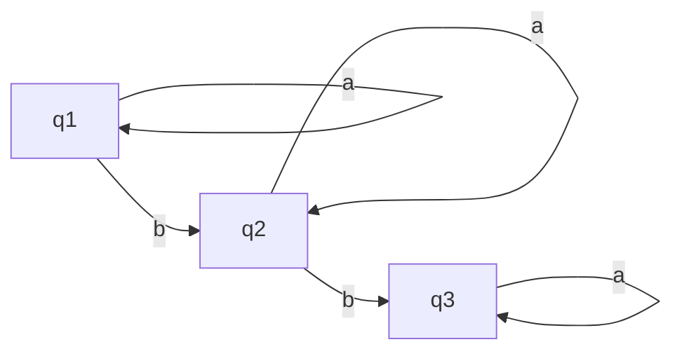

<!-- markdownlint-disable MD010 MD041 MD001 MD036 MD029-->

# Automata and Complexity notes

## Exercise class w1

### Ex1

Prove (uv)^R^ = v^R^u^R^

Proof by induction:
|v| = 0: v = lambda, (u lambda)^R^ = u^R^ = lambda^R^u^R^
IH: |v| = n: v = v'a
|v| = n+1: (uv)^R^ = (uv'a)^R^ = a(uv')^R^ = av'^R^u^R^ = (v'a)^R^u^R^ = v^R^u^R^

### Ex2

Prove that
$$ (L_1 L_2)^R = L_1^R L_2^R$$

$$ L_1 = a $$

### Ex8

